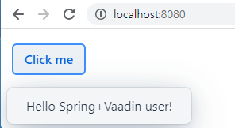
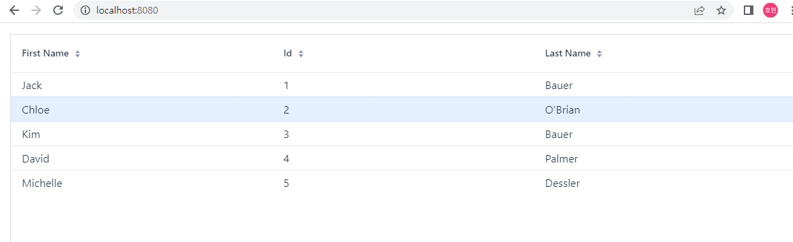

## Vaadin으로 CRUD UI 만들기
이 가이드는 Spring Data JPA 기반 백엔드에서 Vaadin 기반 UI를 사용하는 애플리케이션을 구축하는 과정을 안내합니다 .

### 무엇을 만들 것인가
간단한 JPA 리포지토리를 위한 Vaadin UI를 빌드합니다. 완전한 CRUD(만들기, 읽기, 업데이트 및 삭제) 기능이 있는 애플리케이션과 사용자 지정 리포지토리 방법을 사용하는 필터링 예제를 얻을 수 있습니다.

### 필요한 것
* 약 15분

* 선호하는 텍스트 편집기 또는 IDE

* 자바 17 이상

* Gradle 7.5+ 또는 Maven 3.5+

* 코드를 IDE로 바로 가져올 수도 있습니다.

```
나중에 가이드에서 Vaadin 종속성을 추가합니다.
```

### Entity 만들기
```java
@Entity
public class Customer {

    @Id
    @GeneratedValue
    private Long id;

    private String firstName;

    private String lastName;

    ...

    Getter, Setter 및 생성자는 생략되었습니다.
}
```

### Repository 만들기
```java
public interface CustomerRepository extends JpaRepository<Customer, Long> {

    List<Customer> findByLastNameStartsWithIgnoreCase(String lastName);
}
```

### Application 클래스 만들기
```java
@SpringBootApplication
public class CrudWithVaadinApplication {

    private static final Logger log = LoggerFactory.getLogger(CrudWithVaadinApplication.class);

    public static void main(String[] args) {
        SpringApplication.run(CrudWithVaadinApplication.class);
    }

    @Bean
    public CommandLineRunner loadData(CustomerRepository repository) {
        return (args) -> {
            // save a couple of customers
            repository.save(new Customer("Jack", "Bauer"));
            repository.save(new Customer("Chloe", "O'Brian"));
            repository.save(new Customer("Kim", "Bauer"));
            repository.save(new Customer("David", "Palmer"));
            repository.save(new Customer("Michelle", "Dessler"));

            // fetch all customers
            log.info("Customers found with findAll():");
            log.info("-------------------------------");
            for (Customer customer : repository.findAll()) {
                log.info(customer.toString());
            }
            log.info("");

            // fetch an individual customer by ID
            Customer customer = repository.findById(1L).get();
            log.info("Customer found with findOne(1L):");
            log.info("--------------------------------");
            log.info(customer.toString());
            log.info("");

            // fetch customers by last name
            log.info("Customer found with findByLastNameStartsWithIgnoreCase('Bauer'):");
            log.info("--------------------------------------------");
            for (Customer bauer : repository
                    .findByLastNameStartsWithIgnoreCase("Bauer")) {
                log.info(bauer.toString());
            }
            log.info("");
        };
    }

}
```
- Customer 레포지토리를 주입하고 데이터를 로드하는 CommandLineRunner를 정의합니다.
- 데이터를 로드하고 로그를 기록합니다.

### vaadin 종속성 추가
```
plugins {
    ...
    id 'com.vaadin' version '24.0.5'
}

ext {
	set('vaadinVersion', "24.0.5")
}

dependencies {
    ...
    implementation 'com.vaadin:vaadin-spring-boot-starter'   
}   

dependencyManagement {
	imports {
		mavenBom "com.vaadin:vaadin-bom:${vaadinVersion}"
	}
}
```
vaadin을 사용하기 위해 build.gradle에 종속성을 추가합니다.


### 메인 뷰 클래스 만들기

```java
@Route
public class MainView extends VerticalLayout{

    public MainView(CustomerRepository repo) {
        add(new Button("Click me", e -> Notification.show("Hello Spring+Vaadin user!")));
    }
}
```
- @Route 어노테이션을 사용하여 뷰를 등록합니다.<br>
-> @Route 어노테이션은 Spring Boot에서 제공하는 @RestController와 유사합니다. 
- 버튼을 추가하고 클릭 이벤트를 처리합니다.
- Notification을 사용하여 사용자에게 메시지를 표시합니다. <br>



### 데이터 그리드의 항목으로 나열

```java
@Route
public class MainView extends VerticalLayout{
    
    private final CustomerRepository repo;

    Grid<Customer> grid = new Grid<>(Customer.class);

    public MainView(CustomerRepository repo) {
        this.repo = repo;
        this.grid = new Grid<>(Customer.class);
        add(grid);
        listCustomers();
    }

    private void listCustomers() {
        grid.setItems(repo.findAll());
    }
}
```
- CustomerRepository를 주입하고 데이터 그리드를 생성합니다.
- 데이터 그리드를 레이아웃에 추가하고 listCustomers() 메서드를 호출하여 데이터를 표시합니다.
- 데이터 그리드는 Customer 클래스의 필드를 자동으로 표시합니다. <br>


```
테이블이 크거나 동시 사용자가 많은 경우 전체 데이터 세트를 UI 구성 요소에 바인딩하고 싶지 않을 가능성이 높습니다.
Vaadin Grid는 서버에서 브라우저로 데이터를 지연 로드하지만 이전 접근 방식은 서버 메모리에 전체 데이터 목록을 유지합니다.
```

### 데이터 필터링
큰 데이터 세트가 서버에 문제가 되기 전에 사용자가 편집할 관련 행을 찾으려고 할 때 골칫거리가 될 수 있습니다. TextField 구성 요소를 사용하여 필터 항목을 만들 수 있습니다. 이렇게 하려면 먼저 필터링을 지원하도록 listCustomer() 메서드를 수정합니다.

```java
void listCustomers(String filterText) {
	if (StringUtils.hasText(filterText)) {
		grid.setItems(repo.findByLastNameStartsWithIgnoreCase(filterText));
	} else {
		grid.setItems(repo.findAll());
	}
}
```
```
여기에서 Spring Data의 선언적 쿼리가 유용합니다. findByLastNameStartsWithIgnoringCase 작성은 CustomerRepository 인터페이스의 한 줄 정의입니다.
```
- findByLastNameStartsWithIgnoreCase() : lastName 필드가 주어진 문자열로 시작하는 모든 고객을 찾습니다.
- findByLastNameStartsWithIgnoreCase() 메서드는 필터링된 데이터를 반환합니다. 필터링된 데이터가 없으면 모든 데이터를 반환합니다.


### CustomerEditor 만들기
```java
@SpringComponent
@UIScope
public class CustomerEditor extends VerticalLayout implements KeyNotifier {

    private final CustomerRepository repository;

    private Customer customer;

    /* Fields to edit properties in Customer entity */
    TextField firstName = new TextField("First name");
    TextField lastName = new TextField("Last name");

    /* Action buttons */
    Button save = new Button("Save", VaadinIcon.CHECK.create());
    Button cancel = new Button("Cancel");
    Button delete = new Button("Delete", VaadinIcon.TRASH.create());
    HorizontalLayout actions = new HorizontalLayout(save, cancel, delete);

    Binder<Customer> binder = new Binder<>(Customer.class);
    private ChangeHandler changeHandler;

    @Autowired
    public CustomerEditor(CustomerRepository repository) {
        this.repository = repository;

        add(firstName, lastName, actions);

        // bind using naming convention
        binder.bindInstanceFields(this);

        // Configure and style components
        setSpacing(true);

        save.addThemeVariants(ButtonVariant.LUMO_PRIMARY);
        delete.addThemeVariants(ButtonVariant.LUMO_ERROR);

        addKeyPressListener(Key.ENTER, e -> save());

        // wire action buttons to save, delete and reset
        save.addClickListener(e -> save());
        delete.addClickListener(e -> delete());
        cancel.addClickListener(e -> editCustomer(customer));
        setVisible(false);
    }
    
    void delete() {
        repository.delete(customer);
        changeHandler.onChange();
    }

    void save() {
        repository.save(customer);
        changeHandler.onChange();
    }

    public interface ChangeHandler {
        void onChange();
    }

    public final void editCustomer(Customer c) {
        if (c == null) {
            setVisible(false);
            return;
        }
        final boolean persisted = c.getId() != null;
        if (persisted) {
            // Find fresh entity for editing
            // In a more complex app, you might want to load
            // the entity/DTO with lazy loaded relations for editing
            customer = repository.findById(c.getId()).get();
        }
        else {
            customer = c;
        }
        cancel.setVisible(persisted);
        
        binder.setBean(customer);

        setVisible(true);

        firstName.focus();
    }

    public void setChangeHandler(ChangeHandler h) {
        changeHandler = h;
    }

}

```
- CustomerEditor는 CustomerRepository를 주입받습니다.
- CustomerEditor는 Customer 클래스의 필드를 자동으로 편집합니다.