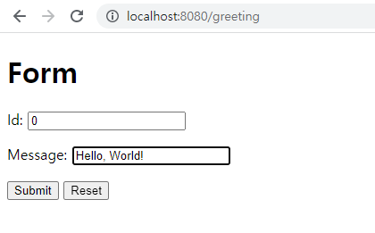
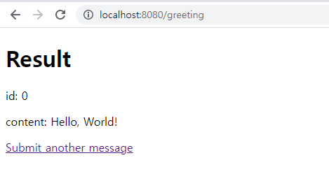

## 양식 제출 처리
이 가이드는 Spring을 사용하여 웹 양식을 만들고 제출하는 과정을 안내합니다.

### 무엇을 만들 것인가
이 가이드에서는 http://localhost:8080/greeting 에서 액세스할 수 있는 웹 양식을 작성합니다.

브라우저에서 이 페이지를 보면 양식이 표시됩니다. ID 및 콘텐츠 양식 필드를 채워 인사말을 제출할 수 있습니다. 양식을 제출하면 결과 페이지가 표시됩니다.
### 필요한 것
* 약 15분
* 선호하는 텍스트 편집기 또는 IDE
* 자바 17 이상
* Gradle 7.5+ 또는 Maven 3.5+
* 코드를 IDE로 바로 가져올 수도 있습니다.

### 이 가이드를 완료하는 방법
대부분의 Spring 시작하기 가이드 와 마찬가지로 처음부터 시작하여 각 단계를 완료하거나 이미 익숙한 기본 설정 단계를 건너뛸 수 있습니다. 어느 쪽이든 작업 코드로 끝납니다.

처음부터 시작 하려면 Spring Initializr로 시작하기 로 이동하십시오 .

기본 사항을 건너뛰 려면 다음을 수행하십시오.

* 이 가이드의 소스 리포지토리를 다운로드하고 압축을 풀거나 Git을 사용하여 복제합니다 .git clone https://github.com/spring-guides/gs-handling-form-submission.git

* cd 로gs-handling-form-submission/initial

* 웹 컨트롤러 만들기 로 이동하십시오 .

작업을 마치면 의 코드와 비교하여 결과를 확인할 수 있습니다 gs-handling-form-submission/complete.

### 스프링 이니셜라이저로 시작하기
이 사전 초기화된 프로젝트를 사용 하고 생성을 클릭하여 ZIP 파일을 다운로드할 수 있습니다. 이 프로젝트는 이 자습서의 예제에 맞게 구성됩니다.

프로젝트를 수동으로 초기화하려면:

1. https://start.spring.io 로 이동합니다 . 이 서비스는 애플리케이션에 필요한 모든 종속성을 가져오고 대부분의 설정을 수행합니다.

2. Gradle 또는 Maven과 사용하려는 언어를 선택합니다. 이 가이드에서는 Java를 선택했다고 가정합니다.

3. 종속성을 클릭 하고 Spring Web 및 Thymeleaf를 선택하십시오 .

4. 생성 을 클릭합니다 .

5. 선택 사항으로 구성된 웹 애플리케이션의 아카이브인 결과 ZIP 파일을 다운로드합니다.

### 웹 컨트롤러 만들기

웹 사이트 구축에 대한 Spring의 접근 방식에서 HTTP 요청은 컨트롤러에 의해 처리됩니다. 이러한 구성 요소는 @Controller 주석으로 쉽게 식별됩니다. 다음 목록(src/main/java/com/example/handlingformsubmission/GreetingController.java에 있음)의 GreetingController는 보기의 이름(이 경우 인사말)을 반환하여 /greeting에 대한 GET 요청을 처리합니다. 다음 보기는 HTML 콘텐츠 렌더링을 담당합니다.

```java     
@Controller
public class GreetingController {

  @GetMapping("/greeting")
  public String greetingForm(Model model) {
    model.addAttribute("greeting", new Greeting());
    return "greeting";
  }

  @PostMapping("/greeting")
  public String greetingSubmit(@ModelAttribute Greeting greeting, Model model) {
    model.addAttribute("greeting", greeting);
    return "result";
  }

}
```
이 컨트롤러는 간결하고 단순하지만 많은 일이 진행됩니다. 이 섹션의 나머지 부분에서는 이를 단계별로 분석합니다.

매핑 주석을 사용하면 HTTP 요청을 특정 컨트롤러 메서드에 매핑할 수 있습니다. 이 컨트롤러의 두 메서드는 모두 /greeting에 매핑됩니다.
@RequestMapping(기본적으로 GET, POST 등과 같은 모든 HTTP 작업을 매핑함)을 사용할 수 있습니다. 그러나 이 경우 greetingForm() 메서드는 @GetMapping을 사용하여 특별히 GET에 매핑되고 greetingSubmit()은 @PostMapping을 사용하여 POST에 매핑됩니다. 이 매핑을 통해 컨트롤러는 /greeting 끝점에 대한 요청을 구분할 수 있습니다.


greetingForm() 메서드는 Model 객체를 사용하여 뷰 템플릿에 새 인사말을 노출합니다. 다음 코드의 Greeting 개체(src/main/java/com/example/handlingformsubmission/Greeting.java에 있음)에는 인사말 보기의 양식 필드에 해당하는 id 및 콘텐츠와 같은 필드가 포함되어 있으며 다음에서 정보를 캡처하는 데 사용됩니다.

```java
public class Greeting {

  private long id;
  private String content;

  public long getId() {
    return id;
  }

  public void setId(long id) {
    this.id = id;
  }

  public String getContent() {
    return content;
  }

  public void setContent(String content) {
    this.content = content;
  }

}
```

메서드 본문의 구현은 뷰 이름(인사말)을 렌더링할 템플릿으로 변환하여 HTML의 서버측 렌더링을 수행하는 뷰 기술에 의존합니다. 이 경우 우리는 Greeting.html 템플릿을 구문 분석하고 다양한 템플릿 표현식을 평가하여 양식을 렌더링하는 Thymeleaf를 사용합니다. 다음 목록(src/main/resources/templates/greeting.html)은 인사말 템플릿을 보여줍니다.
```html
<!DOCTYPE HTML>
<html xmlns:th="https://www.thymeleaf.org">
<head> 
    <title>Getting Started: Handling Form Submission</title>
    <meta http-equiv="Content-Type" content="text/html; charset=UTF-8" />
</head>
<body>
	<h1>Form</h1>
    <form action="#" th:action="@{/greeting}" th:object="${greeting}" method="post">
    	<p>Id: <input type="text" th:field="*{id}" /></p>
        <p>Message: <input type="text" th:field="*{content}" /></p>
        <p><input type="submit" value="Submit" /> <input type="reset" value="Reset" /></p>
    </form>
</body>
</html>
```

th:action="@{/greeting}" 표현식은 /greeting 엔드포인트에 대한 POST로 양식을 지시하는 반면, th:object="${greeting}" 표현식은 양식 데이터 수집에 사용할 모델 객체를 선언합니다. th:field="{id}" 및 th:field="{content}"로 표현되는 두 개의 양식 필드는 Greeting 개체의 필드에 해당합니다.

폼을 표현하기 위한 컨트롤러, 모델, 뷰를 다룹니다. 이제 양식 제출 프로세스를 검토할 수 있습니다. 앞에서 설명한 것처럼 양식은 POST 호출을 사용하여 /greeting 끝점에 제출합니다. greetingSubmit() 메서드는 양식으로 채워진 Greeting 개체를 받습니다. 인사말은 @ModelAttribute이므로 들어오는 양식 콘텐츠에 바인딩됩니다. 
또한 제출된 데이터는 이름(기본적으로 메서드 매개변수의 이름이므로 이 경우 인사말)으로 참조하여 결과 보기에 렌더링할 수 있습니다. 
ID는 <p th:text="'id: ' + ${greeting.id}" /> 식으로 렌더링됩니다. 마찬가지로 콘텐츠는 <p th:text="'content: ' + ${greeting.content}" /> 식으로 렌더링됩니다. 다음 목록(src/main/resources/templates/result.html)은 결과 템플릿을 보여줍니다.

```html
<!DOCTYPE HTML>
<html xmlns:th="https://www.thymeleaf.org">
<head> 
    <title>Getting Started: Handling Form Submission</title>
    <meta http-equiv="Content-Type" content="text/html; charset=UTF-8" />
</head>
<body>
	<h1>Result</h1>
    <p th:text="'id: ' + ${greeting.id}" />
    <p th:text="'content: ' + ${greeting.content}" />
    <a href="/greeting">Submit another message</a>
</body>
</html>
```
명확성을 위해 이 예제에서는 양식을 렌더링하고 제출된 데이터를 표시하기 위해 두 개의 개별 보기 템플릿을 사용합니다. 그러나 두 가지 용도로 단일 보기를 사용할 수 있습니다.

### 응용 프로그램을 실행 가능하게 만들기
외부 애플리케이션 서버에 배포하기 위해 이 서비스를 기존 WAR 파일로 패키징할 수 있지만 더 간단한 방법은 독립 실행형 애플리케이션을 만드는 것입니다. 오래된 Java main() 메서드로 구동되는 실행 가능한 단일 JAR 파일에 모든 것을 패키징합니다. 그 과정에서 외부 인스턴스에 배포하는 대신 Tomcat 서블릿 컨테이너를 HTTP 런타임으로 포함하기 위한 Spring의 지원을 사용합니다. 다음 목록(src/main/java/com/example/handlingformsubmission/HandlingFormSubmissionApplication.java에서)은 애플리케이션 클래스를 보여줍니다.

#### Gradle을 사용하는 경우 다음 명령을 실행하여 애플리케이션을 실행합니다.
./gradlew bootRun ./gradlew build 또는 다음을 사용하여 JAR 파일을 빌드한 후 JAR 파일을 실행할 수 있습니다 .
```
java -jar build/libs/handling-form-submission-0.1.0.jar
```

### 서비스 테스트
이제 웹 사이트가 실행 중이므로 http://localhost:8080/greeting을 방문하면 다음 형식이 표시됩니다. <br>



결과를 보려면 ID와 메시지를 제출하십시오. <br>




