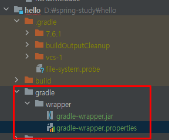

### Gradle로 자바 프로젝트 빌드
이 가이드는 Gradle을 사용하여 간단한 Java 프로젝트를 빌드하는 과정을 안내합니다.

#### 무엇을 만들 것인가
간단한 앱을 만든 다음 Gradle을 사용하여 빌드합니다.

#### 필요한 것
* 약 15분
* 선호하는 텍스트 편집기 또는 IDE
* JDK 6 이상

#### 프로젝트 설정
먼저 Gradle이 빌드할 Java 프로젝트를 설정합니다. Gradle에 계속 집중하려면 지금은 프로젝트를 최대한 간단하게 만드세요.

#### 디렉토리 구조 생성
선택한 프로젝트 디렉터리에서 다음 하위 디렉터리 구조를 만듭니다. 예를 들어, mkdir -p src/main/java/hello*nix 시스템에서:

```
└── src 
    └── main 
        └── java 
            └── hello
```
디렉토리 내에서 src/main/java/hello원하는 Java 클래스를 작성할 수 있습니다. 단순성과 이 가이드의 나머지 부분과의 일관성을 위해 Spring은 두 개의 클래스를 생성할 것을 권장합니다: HelloWorld.java및 Greeter.java.

```
src/main/java/hello/HelloWorld.java
```

```java
package hello;

public class HelloWorld {
  public static void main(String[] args) {
  Greeter greeter = new Greeter();
  System.out.println(greeter.sayHello());
  }
}
```

```agsl
src/main/java/hello/Greeter.java
```

```java
package hello;

public class Greeter {
  public String sayHello() {
  return "Hello world!";
  }
}
```
모든 것이 순조롭게 진행되면 다음과 같은 환영 메시지가 표시됩니다.
```agsl
> Task :help

Welcome to Gradle 7.6.1.

To run a build, run gradle <task> ...

To see a list of available tasks, run gradle tasks

To see more detail about a task, run gradle help --task <task>

To see a list of command-line options, run gradle --help

For more detail on using Gradle, see https://docs.gradle.org/7.6.1/userguide/command_line_interface.html

For troubleshooting, visit https://help.gradle.org

BUILD SUCCESSFUL in 155ms
1 actionable task: 1 executed
오후 3:01:25: Execution finished 'help'.

```

### Gradle이 할 수 있는 일 알아보기
이제 Gradle이 설치되었으므로 무엇을 할 수 있는지 확인하십시오. 프로젝트에 대한 build.gradle 파일을 만들기 전에 어떤 작업이 가능한지 물어볼 수 있습니다.
```
gradle tasks
```
사용 가능한 작업 목록이 표시되어야 합니다. build.gradle 파일이 아직 없는 폴더에서 Gradle을 실행한다고 가정하면 다음과 같은 매우 기본적인 작업이 표시됩니다.

```agsl

Build Setup tasks
-----------------
init - Initializes a new Gradle build.
wrapper - Generates Gradle wrapper files.

Documentation tasks
-------------------
javadoc - Generates Javadoc API documentation for the main source code.

Help tasks
----------
buildEnvironment - Displays all buildscript dependencies declared in root project 'hello'.
dependencies - Displays all dependencies declared in root project 'hello'.
dependencyInsight - Displays the insight into a specific dependency in root project 'hello'.
dependencyManagement - Displays the dependency management declared in root project 'hello'.
help - Displays a help message.
javaToolchains - Displays the detected java toolchains.
outgoingVariants - Displays the outgoing variants of root project 'hello'.
projects - Displays the sub-projects of root project 'hello'.
properties - Displays the properties of root project 'hello'.
resolvableConfigurations - Displays the configurations that can be resolved in root project 'hello'.
tasks - Displays the tasks runnable from root project 'hello'.

Verification tasks
------------------
check - Runs all checks.
test - Runs the test suite.

Rules
-----
Pattern: clean<TaskName>: Cleans the output files of a task.
Pattern: build<ConfigurationName>: Assembles the artifacts of a configuration.

To see all tasks and more detail, run gradle tasks --all

To see more detail about a task, run gradle help --task <task>

BUILD SUCCESSFUL in 205ms
1 actionable task: 1 executed
오후 3:05:22: Execution finished 'tasks'.
```

#### 자바 코드 빌드
build.gradle간단하게 시작하여 이 가이드의 시작 부분에서 만든 <프로젝트 폴더>에 매우 기본적인 파일을 만듭니다 . 한 줄만 지정하십시오.

```agsl
apply plugin: 'java'
```

빌드 구성의 이 한 줄은 상당한 양의 전력을 제공합니다. Gradle 작업을 다시 실행하면 프로젝트 빌드, JavaDoc 생성 및 테스트 실행을 위한 작업을 포함하여 목록에 추가된 새 작업이 표시됩니다.<br>

Gradle 빌드 작업을 자주 사용하게 됩니다 . 이 작업은 코드를 JAR 파일로 컴파일, 테스트 및 어셈블합니다. 다음과 같이 실행할 수 있습니다.

```
gradle build
```

#### 종속성 선언
간단한 Hello World 샘플은 완전히 독립적이며 추가 라이브러리에 의존하지 않습니다. 그러나 대부분의 응용 프로그램은 공통 및/또는 복잡한 기능을 처리하기 위해 외부 라이브러리에 의존합니다.

예를 들어 "Hello World!"라고 말하는 것 외에도 애플리케이션이 현재 날짜와 시간을 인쇄하기를 원한다고 가정합니다. 기본 Java 라이브러리에서 날짜 및 시간 기능을 사용할 수 있지만 Joda Time 라이브러리를 사용하여 더 흥미롭게 만들 수 있습니다.

먼저 HelloWorld.java를 다음과 같이 변경합니다.

```java
package hello;

import org.joda.time.LocalTime;

public class HelloWorld {
  public static void main(String[] args) {
    LocalTime currentTime = new LocalTime();
    System.out.println("The current local time is: " + currentTime);

    Greeter greeter = new Greeter();
    System.out.println(greeter.sayHello());
  }
}
```
여기서 HelloWorldJoda Time의 LocalTime클래스를 사용하여 현재 시간을 가져오고 인쇄합니다.

지금 프로젝트를 빌드하기 위해 실행한 경우 gradle build빌드에서 Joda Time을 컴파일 종속성으로 선언하지 않았기 때문에 빌드가 실패합니다.

먼저 타사 라이브러리에 대한 소스를 추가해야 합니다.

```agsl
repositories { 
    mavenCentral() 
}
```

블록 repositories은 빌드가 Maven 중앙 리포지토리에서 해당 종속성을 해결해야 함을 나타냅니다. Gradle은 Maven Central을 라이브러리 종속성 소스로 사용하는 옵션을 포함하여 Maven 빌드 도구에서 설정한 많은 규칙과 기능에 크게 의존합니다.

이제 타사 라이브러리에 대한 준비가 되었으므로 몇 가지를 선언해 보겠습니다.

```gradle
sourceCompatibility = 1.8
targetCompatibility = 1.8

dependencies {
    implementation "joda-time:joda-time:2.2"
    testImplementation "junit:junit:4.12"
}
```

블록을 사용하여 dependenciesJoda Time에 대한 단일 종속성을 선언합니다. 특히 joda-time 그룹에서 joda-time 라이브러리 버전 2.2(오른쪽에서 왼쪽으로 읽기)를 요청하고 있습니다.

이 종속성에 대해 주목해야 할 또 다른 사항은 이것이 compile종속성이라는 점입니다. 즉, 컴파일 시간 동안(및 WAR 파일을 빌드하는 경우 WAR의 /WEB-INF/libs 폴더에 포함된) 사용 가능해야 함을 나타냅니다. 다른 주목할만한 종속성 유형은 다음과 같습니다.

implementation. 프로젝트 코드를 컴파일하는 데 필요한 종속성이지만 런타임 시 코드를 실행하는 컨테이너(예: Java Servlet API)에서 제공합니다.

testImplementation. 테스트 컴파일 및 실행에 사용되지만 프로젝트의 런타임 코드를 빌드하거나 실행하는 데 필요하지 않은 종속성.

마지막으로 JAR 아티팩트의 이름을 지정하겠습니다.

```agsl
jar {
    archiveBaseName = 'gs-gradle'
    archiveVersion =  '0.1.0'
}
```

이 jar블록은 JAR 파일의 이름을 지정하는 방법을 지정합니다. 이 경우 렌더링됩니다 gs-gradle-0.1.0.jar.

이제 를 실행하면 gradle buildGradle이 Maven Central 리포지토리에서 Joda Time 종속성을 해결하고 빌드가 성공합니다.

### Gradle Wrapper로 프로젝트 빌드
Gradle Wrapper는 Gradle 빌드를 시작하는 기본 방법입니다. Windows용 배치 스크립트와 OS X 및 Linux용 쉘 스크립트로 구성됩니다. 이 스크립트를 사용하면 시스템에 Gradle을 설치하지 않고도 Gradle 빌드를 실행할 수 있습니다. 이전에는 빌드 파일에 추가되었지만 Gradle로 접혀 있으므로 더 이상 필요하지 않습니다. 대신 다음 명령을 사용하면 됩니다.

```agsl
$ gradle wrapper --gradle-version 6.0.1
```

이 작업이 완료되면 몇 가지 새 파일이 표시됩니다. 두 개의 스크립트는 폴더의 루트에 있고 래퍼 jar 및 속성 파일은 새 폴더에 추가되었습니다 gradle/wrapper.

```agsl
└── <project folder>  -- 우리는 hello
    └── gradlew
    └── gradlew.bat
    └── gradle
        └── wrapper
            └── gradle-wrapper.jar
            └── gradle-wrapper.properties
```


이제 Gradle Wrapper를 사용하여 프로젝트를 빌드할 수 있습니다. 버전 제어 시스템에 추가하면 프로젝트를 복제하는 모든 사람이 동일하게 빌드할 수 있습니다. 설치된 Gradle 버전과 완전히 동일한 방식으로 사용할 수 있습니다. 이전에 수행한 것처럼 래퍼 스크립트를 실행하여 빌드 작업을 수행합니다.
```agsl
./gradlew build
```
지정된 Gradle 버전의 래퍼를 처음 실행하면 해당 버전의 Gradle 바이너리를 다운로드하고 캐시합니다. Gradle Wrapper 파일은 특정 버전의 Gradle을 먼저 설치하고 구성하지 않고도 누구나 프로젝트를 빌드할 수 있도록 소스 제어에 커밋되도록 설계되었습니다.

이 단계에서 코드를 빌드하게 됩니다. 여기에서 결과를 볼 수 있습니다.

```agsl
build
├── classes
│   └── main
│       └── hello
│           ├── Greeter.class
│           └── HelloWorld.class
├── dependency-cache
├── libs
│   └── gs-gradle-0.1.0.jar
└── tmp
    └── jar
        └── MANIFEST.MF
```
