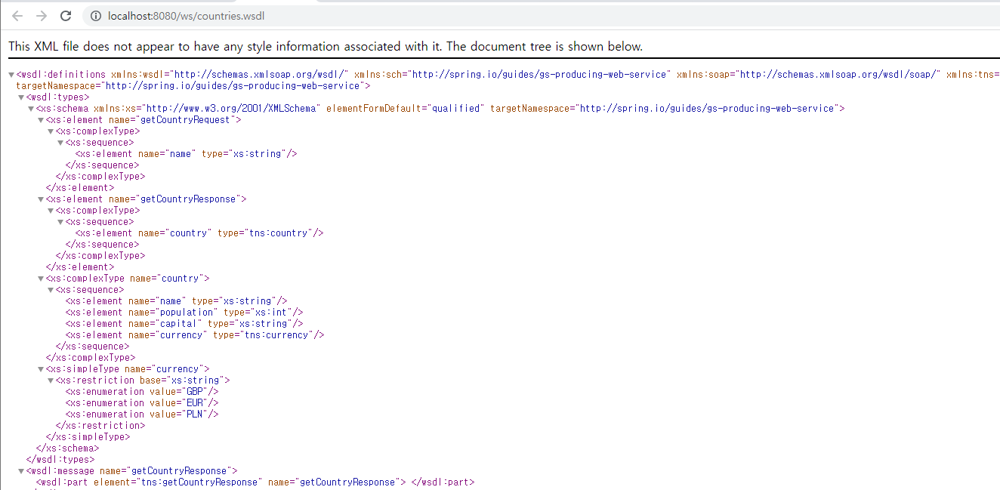

## SOAP 웹 서비스 생성
이 가이드는 Spring을 사용하여 SOAP 기반 웹 서비스 서버를 만드는 과정을 안내합니다.

### 무엇을 만들 것인가
WSDL 기반 SOAP 웹 서비스를 사용하여 다양한 유럽 국가의 데이터를 노출하는 서버를 구축합니다.

```
예제를 단순화하기 위해 영국, 스페인 및 폴란드에 대해 하드코딩된 데이터를 사용합니다.
```

### 필요한 것
* 약 15분

* 선호하는 텍스트 편집기 또는 IDE

* 자바 17 이상

* Gradle 7.5+ 또는 Maven 3.5+

* 코드를 IDE로 바로 가져올 수도 있습니다.

### 이 가이드를 완료하는 방법
대부분의 Spring 시작하기 가이드 와 마찬가지로 처음부터 시작하여 각 단계를 완료하거나 이미 익숙한 기본 설정 단계를 건너뛸 수 있습니다. 어느 쪽이든 작업 코드로 끝납니다.

처음부터 시작 하려면 Spring Initializr로 시작하기 로 이동하십시오 .

기본 사항을 건너뛰 려면 다음을 수행하십시오.

* 이 가이드의 소스 리포지토리를 다운로드하고 압축을 풀거나 Git을 사용하여 복제합니다 .git clone https://github.com/spring-guides/gs-soap-service.git

* cd 로gs-soap-service/initial

* Spring-WS 종속성 추가 로 이동하십시오 .

작업을 마치면 의 코드와 비교하여 결과를 확인할 수 있습니다 gs-soap-service/complete.

### 스프링 이니셜라이저로 시작하기
이 사전 초기화된 프로젝트를 사용 하고 생성을 클릭하여 ZIP 파일을 다운로드할 수 있습니다. 이 프로젝트는 이 자습서의 예제에 맞게 구성됩니다.

프로젝트를 수동으로 초기화하려면:

1. https://start.spring.io 로 이동합니다 . 이 서비스는 애플리케이션에 필요한 모든 종속성을 가져오고 대부분의 설정을 수행합니다.

2. Gradle 또는 Maven과 사용하려는 언어를 선택합니다. 이 가이드에서는 Java를 선택했다고 가정합니다.

3. 종속성을 클릭 하고 Spring Web 및 Spring Web Services를 선택합니다 .

4. 생성 을 클릭합니다 .

5. 선택 사항으로 구성된 웹 애플리케이션의 아카이브인 결과 ZIP 파일을 다운로드합니다.

```
pom.xml및 파일 모두 build.gradle다음 단계에서 추가할 추가 빌드 정보가 필요합니다.
```

### Spring-WS 종속성 추가
프로젝트는 빌드 파일의 종속성으로 spring-ws-core 및 wsdl4j를 포함해야 합니다.

다음 예는 Maven을 사용하는 경우 pom.xml 파일에 대해 수행해야 하는 변경 사항을 보여줍니다.

pom.xml

```xml
<dependency>
    <groupId>wsdl4j</groupId>
    <artifactId>wsdl4j</artifactId>
</dependency>
```
```gradle
dependencies {
	implementation 'org.springframework.boot:spring-boot-starter-web'
	implementation 'org.springframework.boot:spring-boot-starter-web-services'
	implementation 'wsdl4j:wsdl4j'
	jaxb("org.glassfish.jaxb:jaxb-xjc")
	testImplementation('org.springframework.boot:spring-boot-starter-test')
}
```
### 도메인 정의를 위한 XML 스키마 생성
웹 서비스 도메인은 Spring-WS가 자동으로 WSDL로 내보낼 XML 스키마 파일(XSD)에 정의됩니다.

name, population, capital 및 currency 를 반환하는 작업이 포함된 XSD 파일을 만듭니다. 다음 목록(src/main/resources/countries.xsd에서)은 필요한 XSD 파일을 보여줍니다.

```xml
<xs:schema xmlns:xs="http://www.w3.org/2001/XMLSchema" xmlns:tns="http://spring.io/guides/gs-producing-web-service"
           targetNamespace="http://spring.io/guides/gs-producing-web-service" elementFormDefault="qualified">

    <xs:element name="getCountryRequest">
        <xs:complexType>
            <xs:sequence>
                <xs:element name="name" type="xs:string"/>
            </xs:sequence>
        </xs:complexType>
    </xs:element>

    <xs:element name="getCountryResponse">
        <xs:complexType>
            <xs:sequence>
                <xs:element name="country" type="tns:country"/>
            </xs:sequence>
        </xs:complexType>
    </xs:element>

    <xs:complexType name="country">
        <xs:sequence>
            <xs:element name="name" type="xs:string"/>
            <xs:element name="population" type="xs:int"/>
            <xs:element name="capital" type="xs:string"/>
            <xs:element name="currency" type="tns:currency"/>
        </xs:sequence>
    </xs:complexType>

    <xs:simpleType name="currency">
        <xs:restriction base="xs:string">
            <xs:enumeration value="GBP"/>
            <xs:enumeration value="EUR"/>
            <xs:enumeration value="PLN"/>
        </xs:restriction>
    </xs:simpleType>
</xs:schema>
```

### XML 스키마를 기반으로 도메인 클래스 생성
다음 단계는 XSD 파일에서 Java 클래스를 생성하는 것입니다. 올바른 접근 방식은 빌드 시간 동안 Maven 또는 Gradle 플러그인을 사용하여 이 작업을 자동으로 수행하는 것입니다.

다음 목록은 Maven에 필요한 플러그인 구성을 보여줍니다.

```xml
<plugin>
    <groupId>org.codehaus.mojo</groupId>
    <artifactId>jaxb2-maven-plugin</artifactId>
    <version>3.1.0</version>
    <executions>
        <execution>
            <id>xjc</id>
            <goals>
                <goal>xjc</goal>
            </goals>
        </execution>
    </executions>
    <configuration>
        <sources>
            <source>${project.basedir}/src/main/resources/countries.xsd</source>
        </sources>
    </configuration>
</plugin>
```

생성된 클래스는 target/generated-sources/jaxb/ 디렉토리에 있습니다.

Gradle로 동일한 작업을 수행하려면 먼저 다음 목록과 같이 빌드 파일에서 JAXB를 구성해야 합니다.
```
configurations {
	jaxb
}

bootJar {
	archiveBaseName = 'gs-producing-web-service'
	archiveVersion =  '0.1.0'
}
```

```

빌드 파일에는 태그 및 종료 주석이 있습니다. 이 태그를 사용하면 더 자세한 설명을 위해 이 가이드에서 일부를 쉽게 추출할 수 있습니다. 자신의 빌드 파일에는 이러한 주석이 필요하지 않습니다.
```

다음 단계는 Gradle이 Java 클래스를 생성하는 데 사용하는 genJaxb 작업을 추가하는 것입니다. build/generated-sources/jaxb에서 이러한 생성된 Java 클래스를 찾고 genJaxb를 compileJava 작업의 종속성으로 추가하도록 gradle을 구성해야 합니다. 다음 목록은 필요한 추가 사항을 보여줍니다.
```gradle
sourceSets {
	main {
		java {
			srcDir 'src/main/java'
			srcDir 'build/generated-sources/jaxb'
		}
	}
}

task genJaxb {
	ext.sourcesDir = "${buildDir}/generated-sources/jaxb"
	ext.schema = "src/main/resources/countries.xsd"

	outputs.dir sourcesDir

	doLast() {
		project.ant {
			taskdef name: "xjc", classname: "com.sun.tools.xjc.XJCTask",
					classpath: configurations.jaxb.asPath
			mkdir(dir: sourcesDir)

			xjc(destdir: sourcesDir, schema: schema) {
				arg(value: "-wsdl")
				produces(dir: sourcesDir, includes: "**/*.java")
			}
		}
	}
}

compileJava.dependsOn genJaxb
```

Gradle에는 (아직) JAXB 플러그인이 없기 때문에 Ant 작업이 포함되어 있어 Maven보다 조금 더 복잡합니다.

두 경우 모두 JAXB 도메인 개체 생성 프로세스가 빌드 도구의 수명 주기에 연결되어 있으므로 실행할 추가 단계가 없습니다.

### Country Repository 생성
웹 서비스에 데이터를 제공하기 위해 Country 리포지토리를 생성합니다. 이 가이드에서는 하드코딩된 데이터로 더미 국가 리포지토리 구현을 생성합니다. 다음 목록(src/main/java/com/example/producingwebservice/CountryRepository.java)은 그 방법을 보여줍니다.

```java
@Component
public class CountryRepository {

    private static final Map<String, Country> countries = new HashMap<>();

    @PostConstruct
    public void initData() {
        Country spain = new Country();
        spain.setName("Spain");
        spain.setCapital("Madrid");
        spain.setCurrency(Currency.EUR);
        spain.setPopulation(46704314);

        countries.put(spain.getName(), spain);

        Country poland = new Country();
        poland.setName("Poland");
        poland.setCapital("Warsaw");
        poland.setCurrency(Currency.PLN);
        poland.setPopulation(38186860);

        countries.put(poland.getName(), poland);

        Country uk = new Country();
        uk.setName("United Kingdom");
        uk.setCapital("London");
        uk.setCurrency(Currency.GBP);
        uk.setPopulation(63705000);

        countries.put(uk.getName(), uk);
    }

    public Country findCountry(String name) {
        Assert.notNull(name, "The country's name must not be null");
        return countries.get(name);
    }
}

```

### Country Endpoint 생성

Country Endpoint 만들려면 들어오는 SOAP 요청을 처리하기 위해 몇 가지 Spring WS 주석이 있는 POJO만 있으면 됩니다. 다음 목록(src/main/java/com/example/producingwebservice/CountryEndpoint.java)은 이러한 클래스를 보여줍니다.
```java
@Endpoint
public class CountryEndpoint {
    private static final String NAMESPACE_URI = "http://spring.io/guides/gs-producing-web-service";

    private CountryRepository countryRepository;

    @Autowired
    public CountryEndpoint(CountryRepository countryRepository) {
        this.countryRepository = countryRepository;
    }

    @PayloadRoot(namespace = NAMESPACE_URI, localPart = "getCountryRequest")
    @ResponsePayload
    public GetCountryResponse getCountry(@RequestPayload GetCountryRequest request) {
        GetCountryResponse response = new GetCountryResponse();
        response.setCountry(countryRepository.findCountry(request.getName()));

        return response;
    }
}
```
* @Endpoint 주석은 들어오는 SOAP 메시지를 처리하기 위한 잠재적인 후보로 Spring WS에 클래스를 등록합니다.

* 그런 다음 @PayloadRoot 주석은 Spring WS에서 메시지의 네임스페이스 및 localPart를 기반으로 핸들러 메서드를 선택하는 데 사용됩니다.

* @RequestPayload 주석은 들어오는 메시지가 메서드의 요청 매개 변수에 매핑됨을 나타냅니다.

* @ResponsePayload 주석은 Spring WS가 반환된 값을 응답 페이로드에 매핑하도록 합니다.

```
io.spring.guides 클래스는 WSDL을 기반으로 도메인 클래스를 생성하는 작업을 실행하지 않는 한 IDE에서 컴파일 타임 오류를 보고합니다.
```

### 웹 서비스 Bean 구성
다음 목록(src/main/java/com/example/producingwebservice/WebServiceConfig.java)에 나와 있는 것처럼 Spring WS 관련 Bean 구성으로 새 클래스를 만듭니다.

```java
@EnableWs
@Configuration
public class WebServiceConfig extends WsConfigurerAdapter {
    @Bean
    public ServletRegistrationBean<MessageDispatcherServlet> messageDispatcherServlet(ApplicationContext applicationContext) {
        MessageDispatcherServlet servlet = new MessageDispatcherServlet();
        servlet.setApplicationContext(applicationContext);
        servlet.setTransformWsdlLocations(true);
        return new ServletRegistrationBean<>(servlet, "/ws/*");
    }

    @Bean(name = "countries")
    public DefaultWsdl11Definition defaultWsdl11Definition(XsdSchema countriesSchema) {
        DefaultWsdl11Definition wsdl11Definition = new DefaultWsdl11Definition();
        wsdl11Definition.setPortTypeName("CountriesPort");
        wsdl11Definition.setLocationUri("/ws");
        wsdl11Definition.setTargetNamespace("http://spring.io/guides/gs-producing-web-service");
        wsdl11Definition.setSchema(countriesSchema);
        return wsdl11Definition;
    }

    @Bean
    public XsdSchema countriesSchema() {
        return new SimpleXsdSchema(new ClassPathResource("countries.xsd"));
    }
}
```
* Spring WS는 SOAP 메시지를 처리하기 위해 다른 서블릿 유형인 MessageDispatcherServlet을 사용합니다. ApplicationContext를 MessageDispatcherServlet에 주입하고 설정하는 것이 중요합니다. 그렇지 않으면 Spring WS가 Spring 빈을 자동으로 감지하지 않습니다.

* 이 빈에 이름을 지정해도 messageDispatcherServlet은 Spring Boot의 기본 DispatcherServlet 빈을 대체하지 않습니다.

* DefaultMethodEndpointAdapter는 주석 기반 Spring WS 프로그래밍 모델을 구성합니다. 이를 통해 @Endpoint(앞서 언급)와 같은 다양한 주석을 사용할 수 있습니다.

* DefaultWsdl11Definition은 XsdSchema를 사용하여 표준 WSDL 1.1을 노출합니다.

```

MessageDispatcherServlet 및 DefaultWsdl11Definition에 대한 빈 이름을 지정해야 합니다. Bean 이름은 웹 서비스 및 생성된 WSDL 파일을 사용할 수 있는 URL을 결정합니다. 이 경우 WSDL은 http://<host>:<port>/ws/countries.wsdl에서 사용할 수 있습니다.
```

이 구성은 또한 WSDL 위치 서블릿 변환인 servlet.setTransformWsdlLocations(true)를 사용합니다. http://localhost:8080/ws/countries.wsdl을 방문하면 soap:address에 적절한 주소가 지정됩니다. 대신 컴퓨터에 할당된 공용 IP 주소에서 WSDL을 방문하면 해당 주소가 대신 표시됩니다.



### 응용 프로그램을 실행 가능하게 만들기
Spring Boot는 애플리케이션 클래스를 생성합니다. 이 경우 더 이상 수정할 필요가 없습니다. 이 응용 프로그램을 실행하는 데 사용할 수 있습니다. 다음 목록(src/main/java/com/example/producingwebservice/ProducingWebServiceApplication.java)은 애플리케이션 클래스를 보여줍니다

```java
package com.example.producingwebservice;

import org.springframework.boot.SpringApplication;
import org.springframework.boot.autoconfigure.SpringBootApplication;

@SpringBootApplication
public class ProducingWebServiceApplication {

    public static void main(String[] args) {
        SpringApplication.run(ProducingWebServiceApplication.class, args);
    }
}
```
@SpringBootApplication은 다음을 모두 추가하는 편리한 주석입니다.

* @Configuration: 애플리케이션 컨텍스트에 대한 빈 정의의 소스로 클래스에 태그를 지정합니다.

* @EnableAutoConfiguration: 클래스 경로 설정, 기타 빈 및 다양한 속성 설정을 기반으로 빈 추가를 시작하도록 Spring Boot에 지시합니다. 예를 들어 spring-webmvc가 클래스 경로에 있는 경우 이 주석은 애플리케이션을 웹 애플리케이션으로 플래그 지정하고 DispatcherServlet 설정과 같은 주요 동작을 활성화합니다.

* @ComponentScan: com/example 패키지에서 다른 구성 요소, 구성 및 서비스를 찾도록 Spring에 지시하여 컨트롤러를 찾도록 합니다.

main() 메서드는 Spring Boot의 SpringApplication.run() 메서드를 사용하여 애플리케이션을 시작합니다. XML이 한 줄도 없다는 사실을 눈치채셨나요? web.xml 파일도 없습니다. 이 웹 애플리케이션은 100% 순수 Java이며 배관이나 인프라 구성을 처리할 필요가 없습니다.

#### 실행 가능한 JAR 빌드
Gradle 또는 Maven을 사용하여 명령줄에서 애플리케이션을 실행할 수 있습니다. 필요한 모든 종속성, 클래스 및 리소스를 포함하는 단일 실행 가능 JAR 파일을 빌드하고 실행할 수도 있습니다. 실행 가능한 jar을 빌드하면 개발 수명 주기 전체, 다양한 환경 등에 서비스를 애플리케이션으로 쉽게 제공, 버전 지정 및 배포할 수 있습니다.

Gradle을 사용하는 경우 ./gradlew bootRun을 사용하여 애플리케이션을 실행할 수 있습니다. 또는 다음과 같이 ./gradlew build를 사용하여 JAR 파일을 빌드한 다음 JAR 파일을 실행할 수 있습니다.

```
java -jar build/libs/gs-soap-service-0.1.0.jar
```

Maven을 사용하는 경우 ./mvnw spring-boot:run을 사용하여 애플리케이션을 실행할 수 있습니다. 또는 다음과 같이 ./mvnw clean 패키지로 JAR 파일을 빌드한 후 JAR 파일을 실행할 수 있습니다.
```
java -jar target/gs-soap-service-0.1.0.jar
```

### 애플리케이션 테스트
이제 애플리케이션이 실행 중이므로 테스트할 수 있습니다. 다음 SOAP 요청을 포함하는 request.xml이라는 파일을 만듭니다.
```xml
<soapenv:Envelope xmlns:soapenv="http://schemas.xmlsoap.org/soap/envelope/"
                  xmlns:gs="http://spring.io/guides/gs-producing-web-service">
    <soapenv:Header/>
    <soapenv:Body>
        <gs:getCountryRequest>
            <gs:name>Spain</gs:name>
        </gs:getCountryRequest>
    </soapenv:Body>
</soapenv:Envelope>
```


