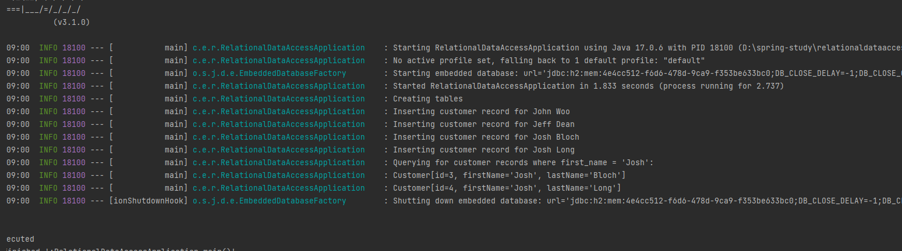

## Spring에서 JDBC를 사용하여 관계형 데이터에 액세스
이 가이드는 Spring을 사용하여 관계형 데이터에 액세스하는 프로세스를 안내합니다.

### 무엇을 만들 것인가
JdbcTemplateSpring을 사용하여 관계형 데이터베이스에 저장된 데이터에 액세스하는 애플리케이션을 빌드합니다 .


### 필요한 것
* 약 15분
* 선호하는 텍스트 편집기 또는 IDE
* 자바 1.8 이상
* Gradle 7.5+ 또는 Maven 3.5+
* 코드를 IDE로 바로 가져올 수도 있습니다.

### 스프링 이니셜라이저로 시작하기
이 사전 초기화된 프로젝트를 사용 하고 생성을 클릭하여 ZIP 파일을 다운로드할 수 있습니다. 이 프로젝트는 이 자습서의 예제에 맞게 구성됩니다.

프로젝트를 수동으로 초기화하려면:

1. https://start.spring.io 로 이동합니다 . 이 서비스는 애플리케이션에 필요한 모든 종속성을 가져오고 대부분의 설정을 수행합니다.
2. Gradle 또는 Maven과 사용하려는 언어를 선택합니다. 이 가이드에서는 Java를 선택했다고 가정합니다.
3. 종속성을 클릭 하고 JDBC API 및 H2 데이터베이스를 선택합니다 .
4. 생성 을 클릭합니다 .
5. 선택 사항으로 구성된 웹 애플리케이션의 아카이브인 결과 ZIP 파일을 다운로드합니다.

```
Customer 객체 만들기
```  
작업하게 될 간단한 데이터 액세스 논리는 고객의 이름과 성을 관리합니다. 애플리케이션 수준에서 이 데이터를 나타내려면 Customer다음 목록(에서 src/main/java/com/example/relationaldataaccess/Customer.java)과 같이 클래스를 만듭니다.

```java
package com.example.relationaldataaccess;

public class Customer {
  private long id;
  private String firstName, lastName;

  public Customer(long id, String firstName, String lastName) {
    this.id = id;
    this.firstName = firstName;
    this.lastName = lastName;
  }

  @Override
  public String toString() {
    return String.format(
        "Customer[id=%d, firstName='%s', lastName='%s']",
        id, firstName, lastName);
  }

  // getters & setters omitted for brevity
}
```

### 데이터 저장 및 검색
JdbcTemplateSpring은 SQL 관계형 데이터베이스 및 JDBC와 쉽게 작업할 수 있도록 하는 템플릿 클래스를 제공합니다 . 대부분의 JDBC 코드는 리소스 획득, 연결 관리, 예외 처리 및 코드가 달성하고자 하는 것과는 전혀 관련이 없는 일반 오류 검사에 빠져 있습니다. JdbcTemplate당신을 위해 모든 것을 처리합니다 . 당신이 해야 할 일은 당면한 일에 집중하는 것뿐입니다. 다음 목록(출처 src/main/java/com/example/relationaldataaccess/RelationalDataAccessApplication.java)은 ​​JDBC를 통해 데이터를 저장하고 검색할 수 있는 클래스를 보여줍니다.
```java
package com.example.relationaldataaccess;

import org.slf4j.Logger;
import org.slf4j.LoggerFactory;
import org.springframework.beans.factory.annotation.Autowired;
import org.springframework.boot.CommandLineRunner;
import org.springframework.boot.SpringApplication;
import org.springframework.boot.autoconfigure.SpringBootApplication;
import org.springframework.jdbc.core.JdbcTemplate;

import java.util.Arrays;
import java.util.List;
import java.util.stream.Collectors;

@SpringBootApplication
public class RelationalDataAccessApplication implements CommandLineRunner {

  private static final Logger log = LoggerFactory.getLogger(RelationalDataAccessApplication.class);

  public static void main(String args[]) {
    SpringApplication.run(RelationalDataAccessApplication.class, args);
  }

  @Autowired
  JdbcTemplate jdbcTemplate;

  @Override
  public void run(String... strings) throws Exception {

    log.info("Creating tables");

    jdbcTemplate.execute("DROP TABLE customers IF EXISTS");
    jdbcTemplate.execute("CREATE TABLE customers(" +
        "id SERIAL, first_name VARCHAR(255), last_name VARCHAR(255))");

    // Split up the array of whole names into an array of first/last names
    List<Object[]> splitUpNames = Arrays.asList("John Woo", "Jeff Dean", "Josh Bloch", "Josh Long").stream()
        .map(name -> name.split(" "))
        .collect(Collectors.toList());

    // Use a Java 8 stream to print out each tuple of the list
    splitUpNames.forEach(name -> log.info(String.format("Inserting customer record for %s %s", name[0], name[1])));

    // Uses JdbcTemplate's batchUpdate operation to bulk load data
    jdbcTemplate.batchUpdate("INSERT INTO customers(first_name, last_name) VALUES (?,?)", splitUpNames);

    log.info("Querying for customer records where first_name = 'Josh':");
    jdbcTemplate.query(
        "SELECT id, first_name, last_name FROM customers WHERE first_name = ?", new Object[] { "Josh" },
        (rs, rowNum) -> new Customer(rs.getLong("id"), rs.getString("first_name"), rs.getString("last_name"))
    ).forEach(customer -> log.info(customer.toString()));
  }
}
```

### @SpringBootApplication다음을 모두 추가하는 편의 주석입니다.

* @Configuration: 애플리케이션 컨텍스트에 대한 빈 정의의 소스로 클래스에 태그를 지정합니다.
* @EnableAutoConfiguration: 클래스 경로 설정, 기타 빈 및 다양한 속성 설정을 기반으로 빈 추가를 시작하도록 Spring Boot에 지시합니다.
* @ComponentScan: 패키지에서 다른 구성 요소, 구성 및 서비스를 찾도록 Spring에 지시합니다 com.example.relationaldataaccess. 이 경우에는 없습니다.

### 실행 가능한 JAR 빌드
Gradle 또는 Maven을 사용하여 명령줄에서 애플리케이션을 실행할 수 있습니다. 필요한 모든 종속성, 클래스 및 리소스를 포함하는 단일 실행 가능 JAR 파일을 빌드하고 실행할 수도 있습니다. 실행 가능한 jar을 빌드하면 개발 수명 주기 전체, 다양한 환경 등에 서비스를 애플리케이션으로 쉽게 제공, 버전 지정 및 배포할 수 있습니다.

```agsl
java -jar 빌드/libs/gs-relational-data-access-0.1.0.jar
```

Gradle을 사용하는 경우 ./gradlew bootRun. ./gradlew build또는 다음을 사용하여 JAR 파일을 빌드한 후 JAR 파일을 실행할 수 있습니다 .
### 출력시 화면

