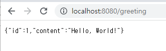
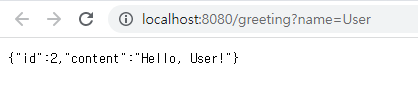

## RESTful 웹 서비스에 대한 Cross Origin 요청 활성화
이 가이드는 응답에 CORS(Cross-Origin Resource Sharing)에 대한 헤더를 포함하는 Spring을 사용하여 "Hello, World" RESTful 웹 서비스를 생성하는 과정을 안내합니다. 이 블로그 게시물 에서 Spring CORS 지원에 대한 자세한 정보를 찾을 수 있습니다 .

### 무엇을 만들 것인가
http://localhost:8080/greeting 다음 목록과 같이 HTTP GET 요청을 수락하고 인사말의 JSON 표현으로 응답하는 서비스를 빌드합니다 .
```json
{"id":1,"content":"Hello, World!"}
```
다음 목록과 같이 쿼리 문자열의 선택적 매개 변수를 사용하여 인사말을 사용자 지정할 수 있습니다 .
```
http://localhost:8080/greeting?name=User
```    
name 매개변수 값은 World의 기본값을 재정의하고 다음 목록과 같이 응답에 반영됩니다.
```json
{"id":1,"content":"Hello, User!"}
```
이 서비스는 Spring Framework CORS 지원을 사용하여 관련 CORS 응답 헤더를 추가한다는 점에서 RESTful 웹 서비스 구축에서 설명한 것과 약간 다릅니다.
### 필요한 것
* 약 15분

* 선호하는 텍스트 편집기 또는 IDE

* 자바 17 이상

* Gradle 7.5+ 또는 Maven 3.5+

* 코드를 IDE로 바로 가져올 수도 있습니다.

### 이 가이드를 완료하는 방법
대부분의 Spring 시작하기 가이드와 마찬가지로 처음부터 시작하여 각 단계를 완료하거나 이미 익숙한 기본 설정 단계를 건너뛸 수 있습니다. 어느 쪽이든 작업 코드로 끝납니다.

처음부터 시작하려면 Spring Initializr로 시작하기로 이동하세요.

기본 사항을 건너뛰려면 다음을 수행하십시오.

* 이 가이드의 소스 리포지토리를 다운로드하고 압축을 풀거나 Git을 사용하여 복제합니다. git clone https://github.com/spring-guides/gs-rest-service-cors.git

* gs-rest-service-cors/initial로 cd

* 자원 표시 클래스 만들기로 이동하십시오.

완료하면 gs-rest-service-cors/complete의 코드와 비교하여 결과를 확인할 수 있습니다.


### 스프링 이니셜라이저로 시작하기
이 사전 초기화된 프로젝트를 사용하고 생성을 클릭하여 ZIP 파일을 다운로드할 수 있습니다. 이 프로젝트는 이 자습서의 예제에 맞게 구성됩니다.

프로젝트를 수동으로 초기화하려면:

1. https://start.spring.io로 이동합니다. 이 서비스는 애플리케이션에 필요한 모든 종속성을 가져오고 대부분의 설정을 수행합니다.

2. Gradle 또는 Maven과 사용하려는 언어를 선택합니다. 이 가이드에서는 Java를 선택했다고 가정합니다.

3. 종속성을 클릭하고 Spring 웹을 선택합니다.

4. 생성을 클릭합니다.

5. 선택 사항으로 구성된 웹 애플리케이션의 아카이브인 결과 ZIP 파일을 다운로드합니다.

### dependencies 추가하기
```
testImplementation 'org.apache.httpcomponents:httpclient'
```

### 완성된 build.gradle
```gradle
plugins {
	id 'org.springframework.boot' version '3.1.0'
	id 'io.spring.dependency-management' version '1.1.0'
	id 'java'
}

group = 'com.example'
version = '0.0.1-SNAPSHOT'
sourceCompatibility = '17'

repositories {
	mavenCentral()
}

dependencies {
	implementation 'org.springframework.boot:spring-boot-starter-web'
	testImplementation 'org.apache.httpcomponents.client5:httpclient5'
	testImplementation 'org.springframework.boot:spring-boot-starter-test'
}

test {
	useJUnitPlatform()
}
```

### 리소스 표현 클래스 만들기
이제 프로젝트 및 빌드 시스템을 설정했으므로 웹 서비스를 만들 수 있습니다.

서비스 상호 작용에 대해 생각하여 프로세스를 시작하십시오.

이 서비스는 /greeting에 대한 GET 요청을 처리하며 선택적으로 쿼리 문자열의 이름 매개변수를 사용합니다. GET 요청은 인사말을 나타내기 위해 본문에 JSON이 포함된 200 OK 응답을 반환해야 합니다. 다음 목록과 유사해야 합니다.
```json
{
    "id": 1,
    "content": "Hello, World!"
}
```
id 필드는 인사말의 고유한 식별자이고 content는 인사말의 텍스트 표현입니다.

인사말 표현을 모델링하려면 자원 표현 클래스를 작성하십시오.

(src/main/java/com/example/restservicecors/Greeting.java)에 나와 있는 것처럼 id 및 콘텐츠 데이터에 대한 필드, 생성자 및 접근자와 함께 일반 이전 Java 개체를 제공합니다.
```java
public class Greeting {

	private final long id;
	private final String content;

	public Greeting() {
		this.id = -1;
		this.content = "";
	}

	public Greeting(long id, String content) {
		this.id = id;
		this.content = content;
	}

	public long getId() {
		return id;
	}

	public String getContent() {
		return content;
	}
}
```

Spring은 Greeting 유형의 인스턴스를 JSON으로 자동 마샬링하기 위해 Jackson JSON 라이브러리를 사용합니다.

### 리소스 컨트롤러 만들기

RESTful 웹 서비스 구축에 대한 Spring의 접근 방식에서 HTTP 요청은 컨트롤러에 의해 처리됩니다. @Controller로 쉽게 식별 할 수 있으며
GreetingController는 /greeting 의 새 인스턴스를 반환하여 GET요청을 처리합니다.

```java
@RestController
public class GreetingController {

	private static final String template = "Hello, %s!";

	private final AtomicLong counter = new AtomicLong();
	@CrossOrigin(origins = "http://localhost:8080")
	@GetMapping("/greeting")
	public Greeting greeting(@RequestParam(required = false, defaultValue = "World") String name) {
		System.out.println("==== get greeting ====");
		return new Greeting(counter.incrementAndGet(), String.format(template, name));
	}

}
```

@RequestMapping은 /greeting 에 대한 HTTP 요청이 greeting() 메섣,에 매핑되도록 합니다.

```
Spring은 원본이 CORS 구성과 일치하지 않는 GET 요청을 여전히 거부합니다. 브라우저는 CORS 프리플라이트 요청을 보낼 필요가 없지만 프리플라이트 검사를 트리거하려면 @PostMapping을 사용하고
본문에서 일부 JSON을 수락할 수 있습니다.
```

@RequestParam은 name 쿼리 문자열 매개변수의 값을 greeting() 메서드의 name 매개변수에 바인딩합니다. 이 쿼리 문자열 매개변수는 필수가 아닙니다. 요청에 없는 경우 World의 defaultValue가 사용됩니다.

메서드 본문의 구현은 카운터의 다음 값을 기반으로 하는 id 특성 값과 쿼리 매개 변수 또는 기본값을 기반으로 하는 콘텐츠 값을 사용하여 새 Greeting 개체를 만들고 반환합니다. 또한 인사말 템플릿을 사용하여 지정된 이름의 서식을 지정합니다.

기존 MVC 컨트롤러와 이전에 표시된 RESTful 웹 서비스 컨트롤러 간의 주요 차이점은 HTTP 응답 본문이 생성되는 방식입니다. 이 RESTful 웹 서비스 컨트롤러는 인사말 데이터의 서버측 렌더링을 HTML로 수행하기 위해 보기 기술에 의존하는 대신 인사말 개체를 채우고 반환합니다. 개체 데이터는 JSON으로 HTTP 응답에 직접 기록됩니다.

### CORS 활성화
개별 컨트롤러에서 또는 전역적으로 CORS(교차 원본 리소스 공유)를 활성화할 수 있습니다. 다음 주제에서는 이를 수행하는 방법을 설명합니다.

* 컨트롤러 방법 CORS 구성

* 글로벌 CORS 구성

### 컨트롤러 방법 CORS 구성
RESTful 웹 서비스가 응답에 CORS 액세스 제어 헤더를 포함하도록 하려면 핸들러 메서드에 @CrossOrigin 주석을 다음 목록과 같이 추가해야 합니다(src/main/java/com/example/restservicecors/GreetingController.java ) 보여줍니다:

```java
    @CrossOrigin(origins = "http://localhost:8080")
    @GetMapping("/greeting")
    public Greeting greeting(@RequestParam(required = false, defaultValue = "World") String name) {
        System.out.println("==== get greeting ====");
        return new Greeting(counter.incrementAndGet(), String.format(template, name));
```


이 @CrossOrigin 주석은 이 특정 메서드에 대해서만 원본 간 리소스 공유를 활성화합니다. 기본적으로 @RequestMapping 주석에 지정된 모든 원본, 모든 헤더 및 HTTP 메서드를 허용합니다. 또한 maxAge 30분이 사용됩니다. 다음 주석 속성 중 하나의 값을 지정하여 이 동작을 사용자 정의할 수 있습니다.

* origins

* methods

* allowedHeaders

* exposedHeaders

* allowCredentials

* maxAge


이 예에서는 http://localhost:8080만 원본 간 요청을 보낼 수 있도록 허용합니다.

```
컨트롤러 클래스 수준에서 @CrossOrigin 주석을 추가하여 이 클래스의 모든 핸들러 메서드에서 CORS를 활성화할 수도 있습니다.
```

### 글로벌 CORS 구성
세분화된 주석 기반 구성 외에도(또는 대안으로) 일부 전역 CORS 구성도 정의할 수 있습니다. 
이것은 필터를 사용하는 것과 유사하지만 Spring MVC 내에서 선언되고 세분화된 @CrossOrigin 구성과 결합될 수 있습니다. 
기본적으로 모든 오리진과 GET, HEAD 및 POST 메서드가 허용됩니다.

```java
	@GetMapping("/greeting-javaconfig")
	public Greeting greetingWithJavaconfig(@RequestParam(required = false, defaultValue = "World") String name) {
		System.out.println("==== in greeting ====");
		return new Greeting(counter.incrementAndGet(), String.format(template, name));
```
```
greetingWithJavaconfig 메서드와 인사말 메서드(컨트롤러 수준 CORS 구성에 사용됨) 간의 차이점은 경로(/greeting이 아닌 /greeting-javaconfig)와 @CrossOrigin 원본의 존재입니다.
```

다음 목록(src/main/java/com/example/restservicecors/RestServiceCorsApplication.java)은 애플리케이션 클래스에 CORS 매핑을 추가하는 방법을 보여줍니다.
```java
	public WebMvcConfigurer corsConfigurer() {
		return new WebMvcConfigurer() {
			@Override
			public void addCorsMappings(CorsRegistry registry) {
				registry.addMapping("/greeting-javaconfig").allowedOrigins("http://localhost:8080");
			}
		};
	}
```

모든 속성(예: 예제의 allowedOrigins)을 쉽게 변경할 수 있을 뿐만 아니라 이 CORS 구성을 특정 경로 패턴에 적용할 수 있습니다.

```
전역 및 컨트롤러 수준 CORS 구성을 결합할 수 있습니다.
```

#### Gradle을 사용하는 경우 다음 명령을 실행하여 애플리케이션을 실행합니다.
./gradlew bootRun ./gradlew build 또는 다음을 사용하여 JAR 파일을 빌드한 후 JAR 파일을 실행할 수 있습니다 .
```
java -jar build/libs/rest-service-cors-0.0.1-SNAPSHOT.jar
```

### 서비스 테스트
이제 서비스가 시작되었으므로 브라우저에서 http://localhost:8080/greeting을 방문하면 다음이 표시됩니다.



http://localhost:8080/greeting?name=User 를 방문하여 이름 조회 문자열 매개변수를 제공하십시오. 콘텐츠 속성의 값이 Hello, World!에서 변경됩니다. 다음 목록과 같이 Hello User!에게 전송합니다.


이 변경은 GreetingController의 @RequestParam 배열이 예상대로 작동함을 보여줍니다. name 매개 변수에는 World의 기본값이 지정되었지만 항상 쿼리 문자열을 통해 명시적으로 재정의할 수 있습니다.

이제 CORS 헤더가 있는지 테스트하고 다른 출처의 Javascript 클라이언트가 서비스에 액세스하도록 허용할 수 있습니다. 이렇게 하려면 서비스를 사용할 Javascript 클라이언트를 만들어야 합니다. 다음 목록은 이러한 클라이언트를 보여줍니다.


먼저 다음 내용으로 hello.js(complete/public/hello.js에서)라는 간단한 Javascript 파일을 만듭니다.
```javascript
$(document).ready(function() {
    $.ajax({
        url: "http://localhost:8080/greeting"
    }).then(function(data, status, jqxhr) {
       $('.greeting-id').append(data.id);
       $('.greeting-content').append(data.content);
       console.log(jqxhr);
    });
});
```
이 스크립트는 jQuery를 사용하여 http://localhost:8080/greeting에서 REST 서비스를 사용합니다. 다음 목록(complete/public/index.html에서)에 표시된 것처럼 index.html에 의해 로드됩니다.

```html
<!DOCTYPE html>
<html>
    <head>
        <title>Hello CORS</title>
        <script src="https://ajax.googleapis.com/ajax/libs/jquery/1.10.2/jquery.min.js"></script>
        <script src="hello.js"></script>
    </head>

    <body>
        <div>
            <p class="greeting-id">The ID is </p>
            <p class="greeting-content">The content is </p>
        </div>
    </body>
</html>
```

이것은 본질적으로 jQuery로 RESTful 웹 서비스 사용에서 생성된 REST 클라이언트이며, 포트 8080의 localhost에서 실행될 때 서비스를 사용하도록 약간 수정되었습니다. 이 클라이언트가 어떻게 개발되었는지에 대한 자세한 내용은 해당 가이드를 참조하십시오.

#### gradle 사용시 커맨드
```
./gradlew bootRun
```