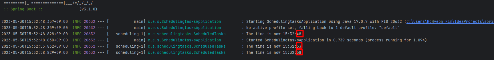

## 예약 작업
이 가이드는 Spring을 사용하여 작업을 예약하는 단계를 안내합니다.

### 무엇을 만들 것인가
Spring의 주석을 사용하여 5초마다 현재 시간을 출력하는 애플리케이션을 빌드합니다 @Scheduled.

### 필요한 것
* 약 15분
* 선호하는 텍스트 편집기 또는 IDE
* 자바 1.8 이상
* Gradle 7.5+ 또는 Maven 3.5+
* 코드를 IDE로 바로 가져올 수도 있습니다.

### 이 가이드를 완료하는 방법
대부분의 Spring 시작하기 가이드 와 마찬가지로 처음부터 시작하여 각 단계를 완료하거나 이미 익숙한 기본 설정 단계를 건너뛸 수 있습니다. 어느 쪽이든 작업 코드로 끝납니다.

처음부터 시작 하려면 Spring Initializr로 시작하기 로 이동하십시오 .

기본 사항을 건너뛰 려면 다음을 수행하십시오.

* 이 가이드의 소스 리포지토리를 다운로드하고 압축을 풀거나 Git을 사용하여 복제합니다 .git clone https://github.com/spring-guides/gs-scheduling-tasks.git

* cd 로gs-scheduling-tasks/initial

* 예약된 작업 만들기 로 이동합니다 .

작업을 마치면 의 코드와 비교하여 결과를 확인할 수 있습니다 gs-scheduling-tasks/complete.

### 스프링 이니셜라이저로 시작하기
이 사전 초기화된 프로젝트를 사용 하고 생성을 클릭하여 ZIP 파일을 다운로드할 수 있습니다. 이 프로젝트는 이 자습서의 예제에 맞게 구성됩니다.

프로젝트를 수동으로 초기화하려면:

1. https://start.spring.io 로 이동합니다 . 이 서비스는 애플리케이션에 필요한 모든 종속성을 가져오고 대부분의 설정을 수행합니다.

2. Gradle 또는 Maven과 사용하려는 언어를 선택합니다. 이 가이드에서는 Java를 선택했다고 가정합니다.

3. 생성 을 클릭합니다 .

4. 선택 사항으로 구성된 웹 애플리케이션의 아카이브인 결과 ZIP 파일을 다운로드합니다.

### Gradle 라이브러리 추가

```java
testImplementation 'org.awaitility:awaitility:3.1.2'
```

### 완료된 build.gradle

```gradle
plugins {
	id 'org.springframework.boot' version '3.0.0'
	id 'io.spring.dependency-management' version '1.1.0'
	id 'java'
}

group = 'com.example'
version = '0.0.1-SNAPSHOT'
sourceCompatibility = '17'

repositories {
	mavenCentral()
}

dependencies {
	implementation 'org.springframework.boot:spring-boot-starter'
	testImplementation 'org.awaitility:awaitility:4.2.0'
	testImplementation('org.springframework.boot:spring-boot-starter-test')
}

test {
	useJUnitPlatform()
}
```

### 예약된 작업 만들기
이제 프로젝트를 설정했으므로 예약된 작업을 만들 수 있습니다. 다음 목록(에서 src/main/java/com/example/schedulingtasks/ScheduledTasks.java)은 이를 수행하는 방법을 보여줍니다.

```java
package com.example.schedulingtasks;

import java.text.SimpleDateFormat;
import java.util.Date;

import org.slf4j.Logger;
import org.slf4j.LoggerFactory;
import org.springframework.scheduling.annotation.Scheduled;
import org.springframework.stereotype.Component;

@Component
public class ScheduledTasks {

    private static final Logger log = LoggerFactory.getLogger(ScheduledTasks.class);

    private static final SimpleDateFormat dateFormat = new SimpleDateFormat("HH:mm:ss");


    @Scheduled(fixedRate = 5000)  // 1분(5000밀리초)마다 실행 -> 5초마다 실행
    public void reportCurrentTime() {
        log.info("The time is now {}", dateFormat.format(new Date()));  // 터미널 로고에 띄우는 멘트
    }

}

```

주석은 Scheduled특정 메서드가 실행되는 시기를 정의합니다.

```
이 예에서는 fixedRate각 호출의 시작 시간부터 측정된 메서드 호출 사이의 간격을 지정하는 를 사용합니다. 작업 완료에서 측정된 호출 사이의 간격을 지정하는 와 같은 다른 옵션이 있습니다 . fixedDelay보다 정교한 작업 예약을 위해 표현식을 사용할 수도 있습니다 @Scheduled(cron=". . .").
```

### 예약 활성화
예약된 작업을 웹 애플리케이션 및 WAR 파일에 포함할 수 있지만 더 간단한 접근 방식(다음 목록 참조)은 독립 실행형 애플리케이션을 생성합니다. 그렇게 하려면 오래된 Java main()메소드로 구동되는 실행 가능한 단일 JAR 파일에 모든 것을 패키징하십시오. 다음 목록(에서 src/main/java/com/example/schedulingtasks/SchedulingTasksApplication.java)은 애플리케이션 클래스를 보여줍니다.

```java
package com.example.schedulingtasks;

import org.springframework.boot.SpringApplication;
import org.springframework.boot.autoconfigure.SpringBootApplication;
import org.springframework.scheduling.annotation.EnableScheduling;

@SpringBootApplication
@EnableScheduling
// 스케줄 관리를 하기 위한 어노테이션 백그라운드 스레드 풀을 생성하고 관리
public class SchedulingtasksApplication {

	public static void main(String[] args) {
		SpringApplication.run(SchedulingtasksApplication.class, args);
	}

}
```

@SpringBootApplication은 다음과 같은 것들을 자동으로 설정합니다.
- @Configuration : 현재 클래스를 구성 클래스로 표시합니다.
- @EnableAutoConfiguration : Spring Boot에게 클래스 경로 설정, 기타 bean 및 다양한 속성 설정을 기반으로 Bean 추가를 시작하도록 지시합니다.
- @ComponentScan : 현재 패키지를 검색하여 Spring 구성 요소를 찾도록 지시합니다. 
- @EnableScheduling : 스케줄 관리를 하기 위한 어노테이션 백그라운드 스레드 풀을 생성하고 관리

Gradle을 사용하는 경우 ./gradlew bootRun. ./gradlew build또는 다음을 사용하여 JAR 파일을 빌드한 후 JAR 파일을 실행할 수 있습니다 .
```java
java -jar build/libs/schedulingtasks-0.1.0.jar
```

로깅 출력이 표시되고 로그에서 백그라운드 스레드에 있음을 확인할 수 있습니다. 예약된 작업이 5초마다 실행되는 것을 볼 수 있습니다. 다음 목록은 일반적인 출력을 보여줍니다.


- 이미지와 같이 5초 마다 스케줄링 하는 것을 알 수 있습니다.