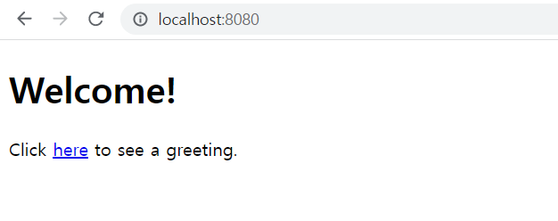
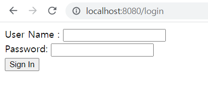
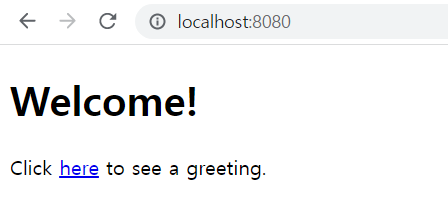

## 웹 애플리케이션 보안
이 가이드는 Spring Security로 보호되는 리소스로 간단한 웹 애플리케이션을 만드는 과정을 안내합니다.

### 무엇을 만들 것인가
고정된 사용자 목록이 지원하는 로그인 양식으로 페이지를 보호하는 Spring MVC 애플리케이션을 빌드합니다.

### 필요한 것
* 약 15분
* 선호하는 텍스트 편집기 또는 IDE
* 자바 17 이상
* Gradle 7.5+ 또는 Maven 3.5+
* 코드를 IDE로 바로 가져올 수도 있습니다.

### 이 가이드를 완료하는 방법
대부분의 Spring 시작하기 가이드 와 마찬가지로 처음부터 시작하여 각 단계를 완료하거나 이미 익숙한 기본 설정 단계를 건너뛸 수 있습니다. 어느 쪽이든 작업 코드로 끝납니다.

처음부터 시작 하려면 Spring Initializr로 시작하기 로 이동하십시오 .

기본 사항을 건너뛰 려면 다음을 수행하십시오.

* 이 가이드의 소스 리포지토리를 다운로드하고 압축을 풀거나 Git을 사용하여 복제합니다 .git clone https://github.com/spring-guides/gs-securing-web.git
* cd 로gs-securing-web/initial
* 보안되지 않은 웹 응용 프로그램 만들기 로 이동하십시오 .

작업을 마치면 의 코드와 비교하여 결과를 확인할 수 있습니다 gs-securing-web/complete.

### 스프링 이니셜라이저로 시작하기
이 사전 초기화된 프로젝트를 사용 하고 생성을 클릭하여 ZIP 파일을 다운로드할 수 있습니다. 이 프로젝트는 이 자습서의 예제에 맞게 구성됩니다.

프로젝트를 수동으로 초기화하려면:

1. https://start.spring.io 로 이동합니다 . 이 서비스는 애플리케이션에 필요한 모든 종속성을 가져오고 대부분의 설정을 수행합니다.
2. Gradle 또는 Maven과 사용하려는 언어를 선택합니다. 이 가이드에서는 Java를 선택했다고 가정합니다.
3. 종속성을 클릭 하고 Spring Web 및 Thymeleaf를 선택하십시오 .
4. 생성 을 클릭합니다 .
5. 선택 사항으로 구성된 웹 애플리케이션의 아카이브인 결과 ZIP 파일을 다운로드합니다.

### 보안되지 않은 웹 애플리케이션 만들기
웹 애플리케이션에 보안을 적용하려면 먼저 보안을 위한 웹 애플리케이션이 필요합니다. 
이 섹션에서는 간단한 웹 애플리케이션을 만드는 과정을 안내합니다. 
그런 다음 다음 섹션에서 Spring Security로 보안을 설정합니다.

웹 애플리케이션에는 홈 페이지와 "Hello, World" 페이지라는 두 가지 간단한 보기가 포함되어 있습니다. 
홈 페이지는 다음 Thymeleaf 템플릿(src/main/resources/templates/home.html)에 정의되어 있습니다.

```html
<!DOCTYPE html>
<html xmlns="http://www.w3.org/1999/xhtml" xmlns:th="https://www.thymeleaf.org">
    <head>
        <title>Spring Security Example</title>
    </head>
    <body>
        <h1>Welcome!</h1>

        <p>Click <a th:href="@{/hello}">here</a> to see a greeting.</p>
    </body>
</html>
```
다음 Thymeleaf 템플릿(src/main/resources/templates/hello.html에서)에 정의된 /hello 페이지에 대한 링크가 포함되어 있습니다.

```html
<!DOCTYPE html>
<html xmlns="http://www.w3.org/1999/xhtml" xmlns:th="https://www.thymeleaf.org">
    <head>
        <title>Hello World!</title>
    </head>
    <body>
        <h1>Hello world!</h1>
    </body>
</html>
```
웹 애플리케이션은 Spring MVC를 기반으로 합니다. 따라서 이러한 템플릿을 노출하려면 Spring MVC를 구성하고 보기 컨트롤러를 설정해야 합니다. 다음 목록(src/main/java/com/example/securingweb/MvcConfig.java)은 애플리케이션에서 Spring MVC를 구성하는 클래스를 보여줍니다.

```java
package com.example.securingweb;

import org.springframework.context.annotation.Configuration;
import org.springframework.web.servlet.config.annotation.ViewControllerRegistry;
import org.springframework.web.servlet.config.annotation.WebMvcConfigurer;

@Configuration
public class MvcConfig implements WebMvcConfigurer {

	public void addViewControllers(ViewControllerRegistry registry) {
		registry.addViewController("/home").setViewName("home");
		registry.addViewController("/").setViewName("home");
		registry.addViewController("/hello").setViewName("hello");
		registry.addViewController("/login").setViewName("login");
	}

}
```

- addViewControllers() 메서드(WebMvcConfigurer에서 같은 이름의 메서드를 재정의함)는 4개의 보기 컨트롤러를 추가합니다. 뷰 컨트롤러 중 두 개는 이름이 home(home.html에 정의됨)인 뷰를 참조하고 다른 하나는 hello라는 뷰(hello.html에 정의됨)를 참조합니다. 네 번째 뷰 컨트롤러는 로그인이라는 다른 뷰를 참조합니다. 다음 섹션에서 해당 뷰를 생성합니다.
- 이 시점에서 "응용 프로그램 실행"으로 이동하여 로그인하지 않고도 응용 프로그램을 실행할 수 있습니다.
- 이제 보안되지 않은 웹 응용 프로그램이 있으므로 여기에 보안을 추가할 수 있습니다.

### Set up Spring Security

- 권한이 없는 사용자가 /hello에서 인사말 페이지를 보는 것을 방지하려고 한다고 가정합니다. 지금처럼 방문자가 홈페이지의 링크를 클릭하면 아무런 장벽 없이 인사말이 표시됩니다. 방문자가 해당 페이지를 보기 전에 로그인하도록 강제하는 장벽을 추가해야 합니다.
- 애플리케이션에서 Spring Security를 ​​구성하여 이를 수행합니다. Spring Security가 클래스 경로에 있는 경우 Spring Boot는 "기본" 인증을 사용하여 모든 HTTP 끝점을 자동으로 보호합니다. 그러나 보안 설정을 추가로 사용자 정의할 수 있습니다. 가장 먼저 해야 할 일은 Spring Security를 ​​클래스 경로에 추가하는 것입니다.
- Gradle을 사용하면 다음 목록과 같이 build.gradle의 종속성 클로저에 세 줄(애플리케이션용, Thymeleaf & Spring Security 통합용, 테스트용)을 추가해야 합니다.

```
implementation 'org.springframework.boot:spring-boot-starter-security'
//  Temporary explicit version to fix Thymeleaf bug
implementation 'org.thymeleaf.extras:thymeleaf-extras-springsecurity6:3.1.1.RELEASE'
implementation 'org.springframework.security:spring-security-test'
```

#### 완성된 build.gradle 파일

```
plugins {
	id 'java'
	id 'org.springframework.boot' version '3.0.0'
	id 'io.spring.dependency-management' version '1.1.0'
}

group = 'com.example'
version = '0.0.1-SNAPSHOT'
sourceCompatibility = '17'

repositories {
	mavenCentral()
}

dependencies {
	implementation 'org.springframework.boot:spring-boot-starter-web'
	implementation 'org.springframework.boot:spring-boot-starter-thymeleaf'
	implementation 'org.springframework.boot:spring-boot-starter-security'
	//  Temporary explicit version to fix Thymeleaf bug
	implementation 'org.thymeleaf.extras:thymeleaf-extras-springsecurity6:3.1.1.RELEASE'
	implementation 'org.springframework.security:spring-security-test'
	testImplementation 'org.springframework.boot:spring-boot-starter-test'
}

test {
	useJUnitPlatform()
}
```

다음 보안 구성(src/main/java/com/example/securingweb/WebSecurityConfig.java에서)은 인증된 사용자만 비밀 인사말을 볼 수 있도록 합니다

```java
package com.example.securingweb;

import org.springframework.context.annotation.Bean;
import org.springframework.context.annotation.Configuration;
import org.springframework.security.config.annotation.web.builders.HttpSecurity;
import org.springframework.security.config.annotation.web.configuration.EnableWebSecurity;
import org.springframework.security.core.userdetails.User;
import org.springframework.security.core.userdetails.UserDetails;
import org.springframework.security.core.userdetails.UserDetailsService;
import org.springframework.security.provisioning.InMemoryUserDetailsManager;
import org.springframework.security.web.SecurityFilterChain;

@Configuration
@EnableWebSecurity
public class WebSecurityConfig {

	@Bean
	public SecurityFilterChain securityFilterChain(HttpSecurity http) throws Exception {
		http
			.authorizeHttpRequests((requests) -> requests
				.requestMatchers("/", "/home").permitAll()
				.anyRequest().authenticated()
			)
			.formLogin((form) -> form
				.loginPage("/login")
				.permitAll()
			)
			.logout((logout) -> logout.permitAll());

		return http.build();
	}

	@Bean
	public UserDetailsService userDetailsService() {
		UserDetails user =
			 User.withDefaultPasswordEncoder()
				.username("user")
				.password("password")
				.roles("USER")
				.build();

		return new InMemoryUserDetailsManager(user);
	}
}
```

- WebSecurityConfig 클래스는 Spring Security의 웹 보안 지원을 활성화하고 Spring MVC 통합을 제공하기 위해 @EnableWebSecurity로 주석 처리됩니다. 또한 웹 보안 구성에 대한 몇 가지 세부 사항을 설정하기 위해 두 개의 빈을 노출합니다.
- SecurityFilterChain 빈은 보호해야 하는 URL 경로와 보호하지 않아야 하는 URL 경로를 정의합니다. 특히 / 및 /home 경로는 인증이 필요하지 않도록 구성됩니다. 다른 모든 경로는 인증되어야 합니다.
- 사용자가 성공적으로 로그인하면 인증이 필요한 이전에 요청한 페이지로 리디렉션됩니다. 사용자 지정 /로그인 페이지(loginPage()에 의해 지정됨)가 있으며 모든 사람이 볼 수 있습니다.
- UserDetailsService 빈은 단일 사용자로 메모리 내 사용자 저장소를 설정합니다. 해당 사용자에게는 user라는 사용자 이름, password라는 암호 및 USER 역할이 부여됩니다.
- 이제 로그인 페이지를 만들어야 합니다. 로그인 뷰에 대한 뷰 컨트롤러가 이미 있으므로 다음 목록(src/main/resources/templates/login.html에서)에 표시된 것처럼 로그인 뷰 자체를 생성하기만 하면 됩니다.

```html
<!DOCTYPE html>
<html xmlns="http://www.w3.org/1999/xhtml" xmlns:th="https://www.thymeleaf.org">
    <head>
        <title>Spring Security Example </title>
    </head>
    <body>
        <div th:if="${param.error}">
            Invalid username and password.
        </div>
        <div th:if="${param.logout}">
            You have been logged out.
        </div>
        <form th:action="@{/login}" method="post">
            <div><label> User Name : <input type="text" name="username"/> </label></div>
            <div><label> Password: <input type="password" name="password"/> </label></div>
            <div><input type="submit" value="Sign In"/></div>
        </form>
    </body>
</html>
```

- Thymeleaf 템플릿은 사용자 이름과 암호를 캡처하여 /login에 게시하는 양식을 제공합니다. 구성된 대로 Spring Security는 해당 요청을 가로채고 사용자를 인증하는 필터를 제공합니다. 사용자가 인증에 실패하면 페이지가 /login?error로 리디렉션되고 페이지에 적절한 오류 메시지가 표시됩니다. 성공적으로 로그아웃하면 애플리케이션이 /login?logout으로 전송되고 페이지에 적절한 성공 메시지가 표시됩니다.
- 마지막으로 방문자에게 현재 사용자 이름을 표시하고 로그아웃하는 방법을 제공해야 합니다. 이렇게 하려면 다음 목록(src/main/resources/templates/hello.html에서)과 같이 현재 사용자에게 인사하고 로그아웃 양식을 포함하도록 hello.html을 업데이트합니다.

```html
<!DOCTYPE html>
<html xmlns="http://www.w3.org/1999/xhtml" xmlns:th="https://www.thymeleaf.org"
      xmlns:sec="https://www.thymeleaf.org/thymeleaf-extras-springsecurity6">
    <head>
        <title>Hello World!</title>
    </head>
    <body>
        <h1 th:inline="text">Hello <span th:remove="tag" sec:authentication="name">thymeleaf</span>!</h1>
        <form th:action="@{/logout}" method="post">
            <input type="submit" value="Sign Out"/>
        </form>
    </body>
</html>
```

- Thymeleaf와 Spring Security의 통합을 사용하여 사용자 이름을 표시합니다. "로그아웃" 양식은 /logout에 POST를 제출합니다. 성공적으로 로그아웃하면 사용자를 /login?logout으로 리디렉션합니다.

```
Thymeleaf 3.1은 더 이상 HttpServletRequest에 대한 액세스를 제공하지 않으므로 HttpServletRequest#getRemoteUser()를 사용하여 현재 인증된 사용자에 액세스할 수 없습니다.
```

### Run the Application
Spring Initializr는 당신을 위한 애플리케이션 클래스를 생성합니다. 이 경우 클래스를 수정할 필요가 없습니다. 다음 목록(src/main/java/com/example/securingweb/SecuringWebApplication.java)은 애플리케이션 클래스를 보여줍니다.

```java
package com.example.securingweb;

import org.springframework.boot.SpringApplication;
import org.springframework.boot.autoconfigure.SpringBootApplication;

@SpringBootApplication
public class SecuringWebApplication {

	public static void main(String[] args) throws Throwable {
		SpringApplication.run(SecuringWebApplication.class, args);
	}

}
```
#### Gradle을 사용하는 경우 다음 명령을 실행하여 애플리케이션을 실행합니다.
./gradlew bootRun ./gradlew build 또는 다음을 사용하여 JAR 파일을 빌드한 후 JAR 파일을 실행할 수 있습니다 .
```
java -jar build/libs/securing-web-0.1.0.jar
```


응용 프로그램이 시작되면 브라우저에서 http://localhost:8080을 가리킵니다. 다음 이미지와 같이 홈 페이지가 표시되어야 합니다.



링크를 클릭하면 /hello의 인사말 페이지로 이동하려고 시도합니다. 그러나 해당 페이지는 보안이 설정되어 있고 아직 로그인하지 않았기 때문에 다음 이미지와 같이 로그인 페이지로 이동합니다.<br>


```
보안되지 않은 버전으로 여기로 이동하면 로그인 페이지가 표시되지 않습니다. 나머지 보안 기반 코드는 백업하고 작성해야 합니다.
```

로그인 페이지에서 사용자 이름과 암호 필드에 각각 사용자와 암호를 입력하여 테스트 사용자로 로그인합니다. 로그인 양식을 제출하면 다음 이미지와 같이 인증된 후 인사말 페이지로 이동합니다.<br>



로그아웃 버튼을 클릭하면 인증이 취소되고 로그아웃되었다는 메시지와 함께 로그인 페이지로 돌아갑니다