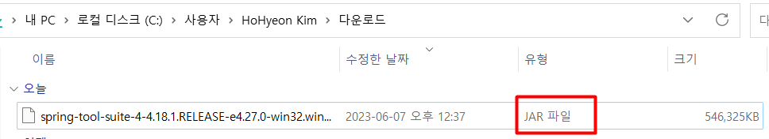

## STS로 시작하기 가이드 작업하기
이 가이드는 시작하기 가이드 중 하나를 빌드하기 위해 STS(Spring Tool Suite)를 사용하는 과정을 안내합니다.

### 무엇을 만들 것인가
Spring 가이드를 선택하여 Spring Tool Suite로 가져옵니다. 그런 다음 가이드를 읽고 코드 작업을 하고 프로젝트를 실행할 수 있습니다.

### 필요한 것
* 약 15분

* 스프링 툴 스위트(STS)

* JDK 8 이상

### STS 설치
아직 STS가 설치되어 있지 않다면 위의 링크를 방문하십시오. 여기에서 플랫폼용 사본을 다운로드할 수 있습니다. 설치하려면 다운로드한 아카이브의 압축을 풀기만 하면 됩니다.

완료되면 계속해서 STS를 시작하십시오.

### STS 설치 과정
#### 1. window로 다운


#### 2. jar파일 압축풀기

다운을 받으면 jar 파일이 나오는데 이 파일을 원하는 곳에서 압축을 풀어줍니다.

```
jar xvf jar이름.jar
```
jar 압축 푸는 명령어

#### 3. contents.zip 압축풀기
jar를 압축 풀면 contents.zip이 나오는데 이 파일을 압축을 풀어줍니다.

#### 4. STS 실행

이제 guide를 이어서 진행 하겠습니다.


### 시작 안내서 가져오기
STS가 실행 중이면 File 메뉴 에서 Import Spring Getting Started Content 마법사를 엽니다 .


팝업 마법사는 Spring 웹 사이트에서 게시된 가이드를 검색하고 선택할 수 있는 기회를 제공합니다. 목록을 훑어보거나 검색어를 입력하여 즉시 옵션을 필터링할 수 있습니다.]

```
기준은 즉시 검색 결과를 제공할 때 제목과 설명 모두에 적용됩니다. 와일드카드가 지원됩니다.
```

1. 사용할 빌드 시스템으로 Maven 또는 Gradle을 선택할 수 있습니다 .
2. 초기 코드 세트, 전체 코드 세트 또는 둘 모두를 가져올지 여부를 결정할 수 있습니다 .
3. 대부분의 프로젝트에서 초기 코드 세트는 빈 프로젝트이므로 가이드를 통해 복사하여 붙여넣을 수 있습니다. 완전한 코드 세트 는 이미 입력된 가이드의 모든 코드입니다.
둘 다 잡으면 작업을 가이드와 비교하고 차이점을 확인할 수 있습니다.
4. STS가 웹사이트의 가이드에 대한 브라우저 탭을 열도록 할 수 있습니다. 이렇게 하면 STS를 떠나지 않고도 가이드를 통해 작업할 수 있습니다.

이 가이드의 목적을 위해 인스턴트 검색 상자에 rest를 입력합니다. 그런 다음 Consuming Rest 를 선택합니다 . 구축을 위해 Maven을 선택 하고 코드 세트를 초기 및 완료하십시오 . 또한 아래와 같이 웹 페이지를 열도록 선택하십시오.


STS는 작업 공간에 두 개의 새 프로젝트를 생성하고 Consuming Rest 코드 베이스(초기 및 전체)를 가져오고 아래와 같이 STS 내에서 브라우저 탭을 엽니다.


<a href="https://spring.io/guides/gs/consuming-rest/">가이드 바로가기 </a> 를 클릭하여 가이드를 시작하십시오. <br>
여기에서 가이드를 살펴보고 코드 파일을 탐색할 수 있습니다.