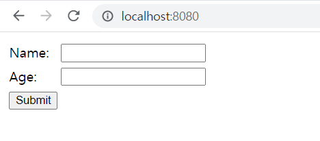
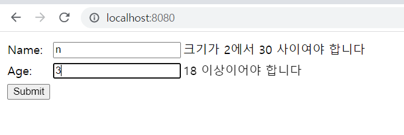
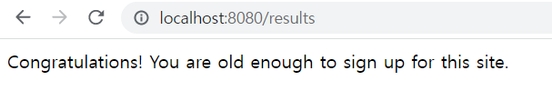

## 양식 입력 확인
이 가이드는 유효성 검사를 지원하기 위해 웹 애플리케이션 양식을 구성하는 과정을 안내합니다.

### 무엇을 만들 것인가
표준 유효성 검사 주석을 사용하여 사용자 입력을 받고 입력을 확인하는 간단한 Spring MVC 애플리케이션을 빌드합니다. 또한 사용자가 입력을 다시 입력하여 유효하게 만들 수 있도록 오류 메시지를 화면에 표시하는 방법도 볼 수 있습니다.

### 필요한 것
* 약 15분
* 선호하는 텍스트 편집기 또는 IDE
* 자바 17 이상
* Gradle 7.5+ 또는 Maven 3.5+
* 코드를 IDE로 바로 가져올 수도 있습니다.

### 이 가이드를 완료하는 방법
대부분의 Spring 시작하기 가이드 와 마찬가지로 처음부터 시작하여 각 단계를 완료하거나 이미 익숙한 기본 설정 단계를 건너뛸 수 있습니다. 어느 쪽이든 작업 코드로 끝납니다.
처음부터 시작 하려면 Spring Initializr로 시작하기 로 이동하십시오 .
기본 사항을 건너뛰 려면 다음을 수행하십시오.

* 이 가이드의 소스 리포지토리를 다운로드하고 압축을 풀거나 Git을 사용하여 복제합니다 .git clone https://github.com/spring-guides/gs-validating-form-input.git
* cd 로gs-validating-form-input/initial
* 개체 만들기PersonForm 로 이동합니다 .

작업을 마치면 의 코드와 비교하여 결과를 확인할 수 있습니다 gs-validating-form-input/complete.

### 스프링 이니셜라이저로 시작하기
이 사전 초기화된 프로젝트를 사용 하고 생성을 클릭하여 ZIP 파일을 다운로드할 수 있습니다. 이 프로젝트는 이 자습서의 예제에 맞게 구성됩니다.

프로젝트를 수동으로 초기화하려면:

1. https://start.spring.io 로 이동합니다 . 이 서비스는 애플리케이션에 필요한 모든 종속성을 가져오고 대부분의 설정을 수행합니다.
2. Gradle 또는 Maven과 사용하려는 언어를 선택합니다. 이 가이드에서는 Java를 선택했다고 가정합니다.
3. 종속성을 클릭 하고 Spring Web , Thymeleaf 및 Validation 을 선택하십시오 .
4. 생성 을 클릭합니다 .
5. 선택 사항으로 구성된 웹 애플리케이션의 아카이브인 결과 ZIP 파일을 다운로드합니다.

### PersonForm 객체 만들기

애플리케이션에는 사용자의 이름과 나이를 확인하는 작업이 포함되므로 먼저 사람을 만드는 데 사용되는 양식을 지원하는 클래스를 만들어야 합니다. 다음 목록(에서 src/main/java/com/example/validatingforminput/PersonForm.java)은 이를 수행하는 방법을 보여줍니다.

```java

package com.example.validatingforminput;

import jakarta.validation.constraints.Min;
import jakarta.validation.constraints.NotNull;
import jakarta.validation.constraints.Size;

public class PersonForm {

	@NotNull
	@Size(min=2, max=30)
	private String name;

	@NotNull
	@Min(18)
	private Integer age;

	public String getName() {
		return this.name;
	}

	public void setName(String name) {
		this.name = name;
	}

	public Integer getAge() {
		return age;
	}

	public void setAge(Integer age) {
		this.age = age;
	}

	public String toString() {
		return "Person(Name: " + this.name + ", Age: " + this.age + ")";
	}
}
```
클래스 PersonForm에는 두 가지 특성이 있습니다. name 과 age. 몇 가지 표준 유효성 검사 주석으로 표시됩니다.

@Size(min=2, max=30): 2~30자 길이의 이름을 허용합니다.

@NotNull: 항목이 비어 있는 경우 Spring MVC가 생성하는 null 값을 허용하지 않습니다.

@Min(18): 18 미만은 허용하지 않습니다.

name은 2~30자 입력을 해야하고, age 는 18세 미만은 허용하지 않고 18세 이상으로 입력해야한다.

### 웹 컨트롤러 만들기
양식 지원 개체를 정의했으므로 이제 간단한 웹 컨트롤러를 만들 차례입니다. 다음 목록(에서 src/main/java/com/example/validatingforminput/WebController.java)은 이를 수행하는 방법을 보여줍니다.

```java
package com.example.validatingforminput;

import jakarta.validation.Valid;

import org.springframework.stereotype.Controller;
import org.springframework.validation.BindingResult;
import org.springframework.web.bind.annotation.GetMapping;
import org.springframework.web.bind.annotation.PostMapping;
import org.springframework.web.servlet.config.annotation.ViewControllerRegistry;
import org.springframework.web.servlet.config.annotation.WebMvcConfigurer;


@Controller
public class WebController implements WebMvcConfigurer {

	@Override
	public void addViewControllers(ViewControllerRegistry registry) {
		registry.addViewController("/results").setViewName("results");
	}

	@GetMapping("/")
	public String showForm(PersonForm personForm) {
		return "form";
	}

	@PostMapping("/")
	public String checkPersonInfo(@Valid PersonForm personForm, BindingResult bindingResult) {

		if (bindingResult.hasErrors()) {
			return "form";
		}

		return "redirect:/results";
	}
}
```

이 컨트롤러에는 GET 메서드와 POST 메서드가 있습니다. 두 방법 모두 에 매핑됩니다 /.
메서드 는 템플릿을 showForm 반환합니다 form. PersonForm 템플릿이 양식 특성을 와 연결할 수 있도록 메서드 서명에 를 포함합니다 PersonForm.
이 checkPersonInfo 메서드는 두 가지 인수를 허용합니다.

* 양식에 채워진 속성을 수집하기 위해 personForm로 표시된 개체입니다.
* bindingResult 유효성 검사 오류를 테스트하고 검색할 수 있는 개체입니다.
* @Vaild 사용시 그 뒤에 오는 객체에 대한 유효성 검사를 수행합니다. 

개체에 바인딩된 양식에서 모든 특성을 검색할 수 있습니다 PersonForm. 코드에서 오류를 테스트합니다. 오류가 발생하면 사용자를 원래 form템플릿으로 다시 보낼 수 있습니다. 이 경우 모든 오류 속성이 표시됩니다.

사람의 속성이 모두 유효하면 브라우저를 최종 results 템플릿으로 리디렉션합니다.

### HTML 프런트 엔드 구축
이제 다음 목록(에서 src/main/resources/templates/form.html)과 같이 "기본" 페이지를 빌드합니다.

```html
<!DOCTYPE HTML>
<html xmlns:th="http://www.thymeleaf.org">
    <body>
        <form action="#" th:action="@{/}" th:object="${personForm}" method="post">
            <table>
                <tr>
                    <td>Name:</td>
                    <td><input type="text" th:field="*{name}" /></td>
                    <td th:if="${#fields.hasErrors('name')}" th:errors="*{name}">Name Error</td>
                </tr>
                <tr>
                    <td>Age:</td>
                    <td><input type="text" th:field="*{age}" /></td>
                    <td th:if="${#fields.hasErrors('age')}" th:errors="*{age}">Age Error</td>
                </tr>
                <tr>
                    <td><button type="submit">Submit</button></td>
                </tr>
            </table>
        </form>
    </body>
</html>
```

이 페이지에는 각 필드가 테이블의 별도 셀에 있는 간단한 양식이 포함되어 있습니다. 웹컨트롤러의 메소드 personForm에서 본 객체 로 백업중이라고 표시되어 있습니다. bean 에는 두 개의 필드가 있으며 , 및 PersonForm로 태그가 지정된 것을 볼 수 있습니다 . <br> 
th:field="*{name}"th:field="*{age}" : 각 필드 옆에는 유효성 검사 오류를 표시하는 데 사용되는 보조 요소가 있습니다.
마지막으로 양식을 제출하는 버튼이 있습니다. 일반적으로 사용자가 제약 조건을 위반하는 이름이나 나이를 입력하면 @Valid오류 메시지가 표시된 이 페이지로 되돌아갑니다. 유효한 이름과 나이를 입력하면 사용자는 다음 웹 페이지로 이동합니다.

다음 예(에서 src/main/resources/templates/results.html)는 결과 페이지를 보여줍니다.

```html
<html>
	<body>
		Congratulations! You are old enough to sign up for this site.
	</body>
</html>
```

```
이 간단한 예에서 이러한 웹 페이지에는 정교한 CSS 또는 JavaScript가 없습니다.
```

### 애플리케이션 실행
이 애플리케이션의 경우 Thymeleaf 의 템플릿 언어를 사용하고 있습니다 . 이 응용 프로그램에는 원시 HTML 이상이 필요합니다. Spring Initializr는 당신을 위한 애플리케이션 클래스를 생성했습니다. 다음 목록(에서 src/main/java/com/example/validatingforminput/ValidatingFormInputApplication.java)은 해당 클래스를 보여줍니다.
```java
package com.example.validatingforminput;

import org.springframework.boot.SpringApplication;
import org.springframework.boot.autoconfigure.SpringBootApplication;

@SpringBootApplication
public class ValidatingFormInputApplication {

	public static void main(String[] args) throws Exception {
		SpringApplication.run(ValidatingFormInputApplication.class, args);
	}

}
```

#### Gradle을 사용하는 경우

```
java -jar 빌드/libs/gs-validating-form-input-0.1.0.jar
```

응용 프로그램이 몇 초 내에 시작되어 실행되어야 합니다.

http://localhost:8080 을 방문하면 이미지와 같은 내용이 표시됩니다.



유효성 검사가 잘 되는지 테스트 하는 과정입니다.


유효성검사가 잘되는 점을 확인 하고 성공하는 과정입니다.


